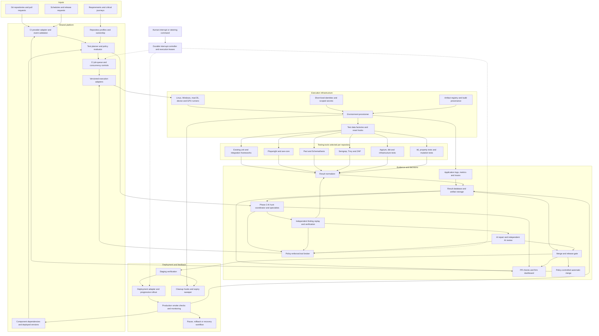
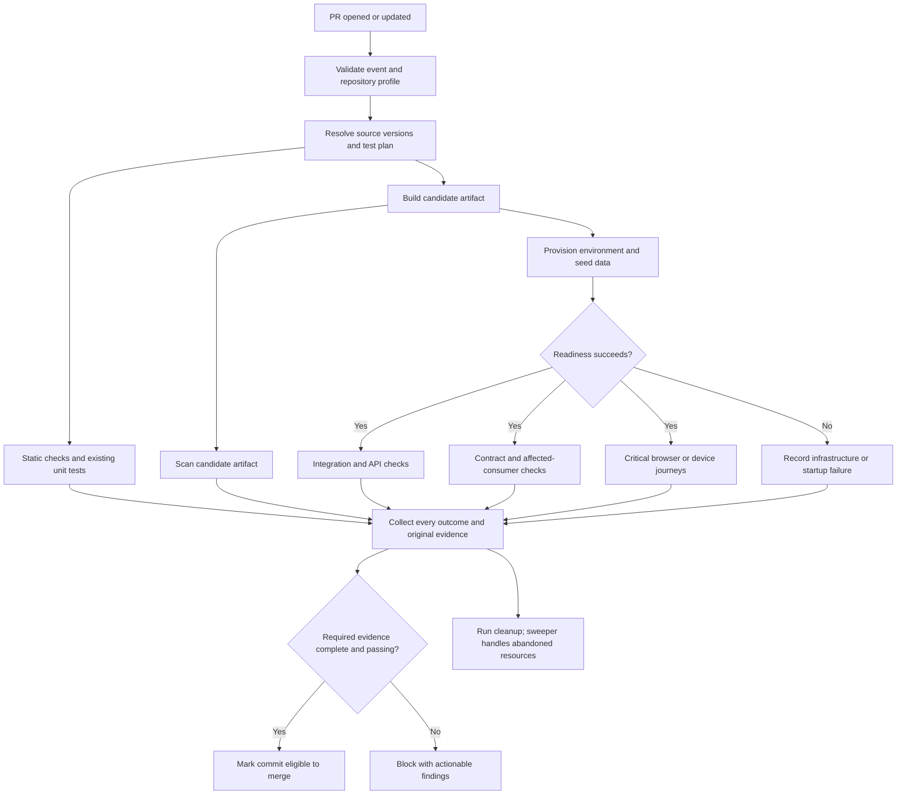
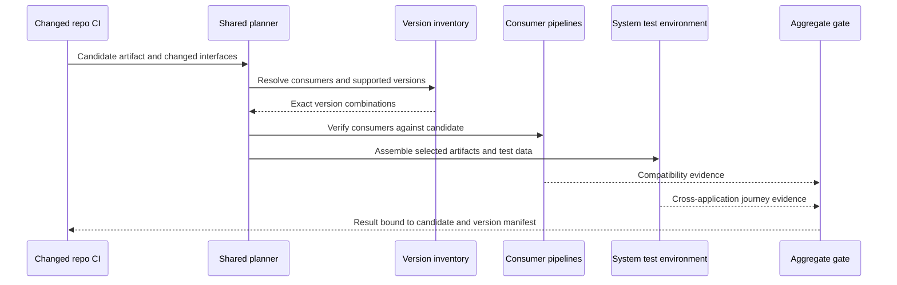
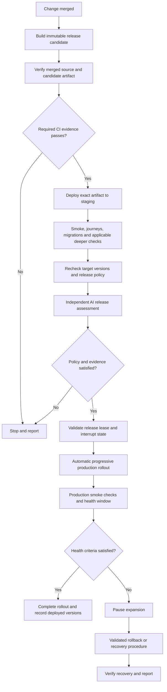
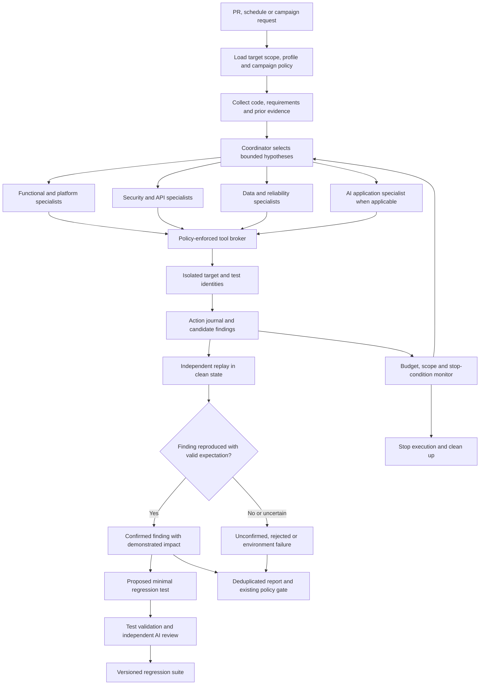
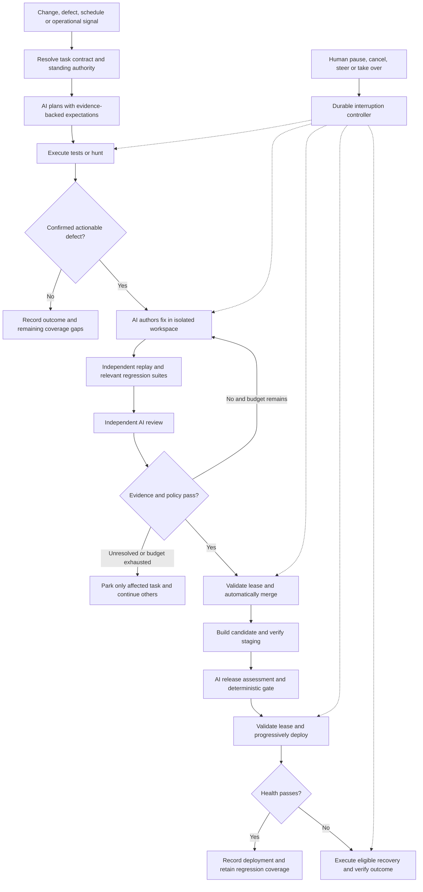

# Katydid: firm-wide automated testing and CI/CD platform

**Status:** Architecture and implementation blueprint, partially implemented in Katydid. A working single-host controller, AI repair/delivery flow, and local environment lifecycle are implemented; this document also proposes capabilities that remain future work. See the [implementation record](docs/IMPLEMENTATION.md) and [environment increment](docs/ENVIRONMENT_PLAN.md) for verified scope and remaining boundaries.

**Prepared:** 7 September 2026.

**Audience:** Engineering leads, platform engineers, developers, and QA engineers.

## 1. Recommendation and scope

Build a shared testing platform that understands repository profiles, selects appropriate checks, runs existing testing tools, and produces consistent evidence for merge and release decisions.

Use the firm's existing CI provider as the initial execution backbone. Add a small shared orchestration layer and adapters. Keep application tests beside application code. Keep journeys that span multiple repositories in a shared system-test repository.

**Phase 1 establishes automated testing, isolated environments, and evidence collection. Phase 2 introduces a coordinated AI bug-hunting and security red-team capability.** Specialized agents use the same repository adapters to investigate functional, security, reliability, and platform-specific failure modes. Subsequent phases expand cross-repository reach, deployment integration, and firm-wide coverage.

**Operating model: AI in the loop, with humans able to interrupt at any point.** Within standing firm policy, the system autonomously discovers repositories, plans and runs checks, hunts defects, verifies findings, writes and reviews fixes, merges eligible changes, deploys, monitors, and recovers. Routine work has no human approval queue or mandatory waiting period. Human participation is optional supervision and steering; exceptional work outside delegated authority is isolated while other work continues. Section 23 specifies this model in detail.

The platform should support web apps, backend services, libraries, mobile and desktop apps, data pipelines, infrastructure, documentation, and specialist workloads through extension points. Every repository can participate, but the required tests and supported environments will differ.

**Automation covers repeatable execution, environment preparation, reporting, and configured release decisions. It does not guarantee that every possible defect is tested.** AI derives business expectations and supported environments from authoritative requirements, contracts, policies, and verified examples, and authors missing tests. Where intent cannot be established, it records uncertainty and continues independent work rather than inventing correctness. Missing coverage remains visible.

This document proposes an architecture. Component names, the manifest format, policies, and example thresholds below are design choices to implement and validate. They are not a claim that a single existing product provides this complete system out of the box.

### Assumptions

- The firm has Git repositories and a CI provider, but its actual inventory and infrastructure are not yet known.
- GitHub Actions is the reference CI implementation. Existing GitLab or Jenkins installations can integrate through a provider adapter without migrating application tests.
- Container-capable Linux runners handle suitable workloads. Windows, macOS, devices, GPUs, and specialist hardware use separate runner pools when required.
- AI roles perform routine application and test maintenance; named human owners retain accountability and the ability to intervene without becoming mandatory reviewers.
- The target release policy delegates routine review, merge, deployment, and recovery to the autonomous system. Any existing provider-enforced human-only gate is an adoption configuration issue to resolve explicitly; agents do not pretend that an AI decision satisfies an incompatible provider rule.
- Product editions, licenses, supported versions, and runner compatibility must be checked during the pilot. The tool list is a selection guide, not an instruction to buy or install every product.

## 2. Document map

1. Recommendation and scope
2. Document map
3. Complete component architecture
4. What to build and what to reuse
5. Tool arsenal and selection rules
6. Repository onboarding, step by step
7. Repository manifest and adapter contract
8. Coverage by repository type
9. Pull-request testing, step by step
10. Cross-repository testing and version selection
11. Environment and test-data lifecycle
12. Test scenarios and expected outcomes
13. Continuous delivery and deployment, step by step
14. Scheduled and production checks
15. Results, gates, and failure handling
16. Phase 2: automated AI bug hunting and red teaming
17. Platform reliability, access, and maintenance
18. Performance and cost controls
19. Ownership and repository layout
20. Implementation roadmap and acceptance criteria
21. Worked example
22. Decisions needed before implementation
23. Autonomous operation with human interruption

## 3. Complete component architecture

The diagram shows logical responsibilities. During the pilot, several boxes can be modules in one shared workflow or service. Separate services are justified only by scale or operational requirements.



| Component | Responsibility | Pilot implementation |
|---|---|---|
| Provider adapter | Translate PR, merge, schedule, and release events into run requests | Existing CI event triggers |
| Catalog | Store components, profiles, owners, and required behaviours | Versioned manifests; existing catalog if available |
| Dependency graph | Identify consumers and compatible version combinations | Declared dependencies and a deployment inventory |
| Planner | Select checks and explain selections and exclusions | Deterministic rules in a shared workflow or CLI |
| Queue | Apply limits, priorities, cancellation, and timeouts | Existing CI queue and concurrency features |
| Adapter registry | Connect a check type to its runner and result parser | Versioned modules in the platform repository |
| Provisioner | Start required applications, databases, devices, or cloud resources | Existing scripts, Testcontainers, or environment adapter |
| Evidence collector | Normalize results while retaining original reports | Small reporting module |
| Gate | Decide whether required evidence satisfies policy | One aggregate required check |
| Dashboard | Show failures, ownership, history, and coverage gaps | CI summaries first; database-backed dashboard later |
| Deployment adapter | Promote artifacts and report deployed versions | Existing deployment pipeline |
| Cleanup controller | Remove expired test resources after failure or cancellation | Teardown hooks plus independent scheduled sweeper |

## 4. What to build and what to reuse

### Build the firm-specific coordination

1. A versioned repository-profile schema and validator.
2. A deterministic planner with documented rules for each repository type and risk tier.
3. Adapters for existing test commands, environment setup, deployment, and results.
4. A dependency and deployment inventory for cross-repository decisions.
5. A normalized result record and aggregate gate.
6. An onboarding workflow and coverage-gap report.
7. A central history view when CI summaries become insufficient.

### Reuse established execution tools

Reuse the existing CI scheduler, identity provider, secret manager, artifact registry, test frameworks, cloud provisioning, and observability stack. Do not introduce a second scheduler, catalog, or monitoring stack until there is a demonstrated need.

The first version does not require Kubernetes, a dedicated message broker, or a new developer portal. Its AI onboarding and review roles can use a small model adapter over the existing CI executor; specialized hunting expands in Phase 2. GitHub Actions supports sharing whole workflows between repositories through reusable workflows. [GitHub reusable workflows](https://docs.github.com/en/actions/how-tos/reuse-automations/reuse-workflows)

## 5. Tool arsenal and selection rules

**Core** means part of the initial platform. **Profile** means enabled when applicable. **Later** means added after the basic execution and reporting path is reliable.

### 5.1 Coordination, environments, and delivery

| Tool or capability | Adoption | Purpose and selection rule |
|---|---|---|
| Existing CI; GitHub Actions reference | Core | Event triggers, jobs, runner selection, artifacts, and PR checks. Centralize common work with [reusable workflows](https://docs.github.com/en/actions/how-tos/reuse-automations/reuse-workflows). |
| Custom profile validator and planner | Core | Understand each component and produce an explicit test plan. Keep rules transparent and versioned. |
| Existing scripts and container runtime | Core where applicable | Preserve known build and startup procedures; standardize inputs and evidence. |
| Dagger | Later, if portability is needed | Package reusable pipeline functions for suitable workloads. Evaluate against native reusable CI workflows before adopting both. [Dagger reusability](https://docs.dagger.io/features/modules) |
| Testcontainers | Profile | Start disposable database, queue, and other service dependencies from integration tests. Select a supported language integration. [Getting started](https://testcontainers.com/getting-started/) |
| Backstage | Later or existing | Reuse component ownership and dependency metadata if already installed. It is a catalog, not the test execution engine. [Catalog descriptors](https://backstage.io/docs/features/software-catalog/descriptor-format/) |
| Existing secret manager plus OIDC | Core where supported | Issue scoped, short-lived cloud credentials to jobs through configured trust relationships. [GitHub OIDC](https://docs.github.com/en/actions/concepts/security/openid-connect) |
| Existing artifact registry | Core | Store immutable images, packages, binaries, and release manifests. |
| Artifact attestations | Profile | Record and verify build provenance for produced artifacts. A valid attestation does not prove functional correctness. [GitHub attestations](https://docs.github.com/en/actions/concepts/security/artifact-attestations) |
| Existing deployment system | Core for deployable repos | Deploy the tested artifact and report its identity and outcome. |
| Argo Rollouts | Later, Kubernetes only | Add canary or blue-green deployment and automated analysis where Kubernetes is already used. [Argo Rollouts](https://argo-rollouts.readthedocs.io/en/stable/) |
| CI storage initially; result database and object storage later | Core capability | Keep searchable metadata separate from larger logs, traces, and screenshots. Use the firm's supported storage products. |
| OpenTelemetry plus existing monitoring backend | Profile | Correlate application traces, metrics, and logs with the test run; OpenTelemetry supplies instrumentation and collection, not the whole storage/UI backend. [OpenTelemetry](https://opentelemetry.io/docs/) |

### 5.2 Functional and specialist testing

| Tool | Adoption | What it tests | Important boundary |
|---|---|---|---|
| Existing unit framework; Vitest for suitable JS/TS repos | Core profile | Functions, modules, and application logic | Keep established frameworks if they work. [Vitest](https://vitest.dev/guide/) |
| pytest | Python profile | Unit, integration, and custom checks | Expected behaviour and fixtures must be written. [pytest](https://docs.pytest.org/en/stable/) |
| JUnit | JVM profile | Existing Java/JVM test suites | Select a version compatible with the repo's JDK. [JUnit guide](https://junit.org/junit5/docs/current/user-guide/) |
| dotnet test with the repo's framework | .NET profile | Existing .NET test projects | Preserve framework and runner compatibility. [Microsoft testing guide](https://learn.microsoft.com/en-us/dotnet/core/testing/unit-testing-with-dotnet-test) |
| Existing language-native commands | Other language profiles | Existing Go, Rust, C/C++, or specialist suites | Custom-command adapters provide an escape hatch. |
| Playwright | Web profile | Browser journeys, HTTP API checks, browser matrices, and visual comparisons | Tests the running application; requires assertions and stable data. [CI](https://playwright.dev/docs/ci), [API tests](https://playwright.dev/docs/api-testing), [visual checks](https://playwright.dev/docs/test-snapshots) |
| axe-core through Playwright | Web profile | Automatically detectable accessibility issues | Add AI-assisted keyboard and UI exploration; record remaining gaps because neither automation nor AI proves complete accessibility. Human evaluation is optional supplementary evidence. [Playwright accessibility](https://playwright.dev/docs/accessibility-testing) |
| Pact and Pact Broker | Connected-service profile | Consumer/provider contracts and version compatibility | Only covers declared and verified contracts. [Deployment compatibility](https://docs.pact.io/pact_broker/can_i_deploy) |
| Schemathesis | API profile | Generate API test cases from supported schemas | Schema-based checks need additional business assertions. [Schemathesis](https://schemathesis.readthedocs.io/en/stable/) |
| Appium with appropriate drivers | Mobile or supported desktop profile | User journeys on target platforms | Requires platform-specific drivers, runners, and devices; verify target support. [Appium architecture](https://appium.io/docs/en/latest/intro/) |
| dbt data tests | dbt profile | Data assertions such as uniqueness, non-null values, and relationships | Other pipeline systems use their own validation adapter. [dbt tests](https://docs.getdbt.com/docs/build/data-tests) |
| Terraform test | Terraform profile | Module behaviour using plans or applied test infrastructure | Applied tests create resources and need isolated accounts, budgets, and teardown. [Terraform tests](https://developer.hashicorp.com/terraform/language/tests) |
| Conftest | Configuration profile | Policy assertions against structured configuration | Policies must reflect firm requirements. [Conftest](https://www.conftest.dev/) |

### 5.3 Security, performance, and test effectiveness

| Tool or capability | Adoption | Purpose | Selection rule |
|---|---|---|---|
| Semgrep | Supported-language profile | Static analysis using selected rules | Integrate existing scanners first; validate language and edition coverage. [CI configurations](https://semgrep.dev/docs/semgrep-ci/sample-ci-configs) |
| Trivy | Applicable repository/artifact profiles | Vulnerability, misconfiguration, and secret scanning for supported targets | Configure target-specific scanners and findings policies; schedule rescans as vulnerability information changes. [Trivy guide](https://trivy.dev/docs/latest/guide/) |
| Existing dedicated secret scanner | Core capability | Detect credentials in changes and, where supported, Git history | Use one maintained firm standard; filesystem scanning alone is not a complete history audit. |
| Gitleaks | Existing-installation option | Git and file secret detection | The upstream README currently describes feature-complete maintenance with security patches; assess lifecycle before selecting it for a new firm-wide standard. [Upstream README](https://github.com/gitleaks/gitleaks) |
| OWASP ZAP | Web/API profile | Passive baseline scanning; separate configured active scans | Baseline scanning spiders the target and evaluates passive findings; it is not a full penetration test. [ZAP baseline](https://www.zaproxy.org/docs/docker/baseline-scan/) |
| k6 | Performance profile | Load scenarios with latency and error-rate thresholds | Run against controlled environments with representative workloads. [k6 thresholds](https://grafana.com/docs/k6/latest/using-k6/thresholds/) |
| Hypothesis | Python, later | Property-based tests over generated inputs | Developers define invariants; retain failure examples and seeds where applicable. [Hypothesis](https://hypothesis.readthedocs.io/en/latest/) |
| Stryker | Supported stacks, later | Assess whether tests detect deliberate code mutations | Use on selected critical modules; mutation cost and equivalent mutations require interpretation. [Stryker](https://stryker-mutator.io/docs/) |
| Existing fault-injection tooling or controlled dependency simulator | Later | Timeouts, dropped connections, queue disruption, and recovery | Begin in isolated environments with explicit failure scenarios. |
| Custom evaluation harness | AI/ML profile | Dataset regression, task quality, model behaviour, and latency | Use versioned evaluation sets and task-specific metrics; separate statistical quality gates from deterministic checks. |

### 5.4 Initial selection

For the pilot, use the existing CI, repository-native tests, Playwright for web journeys, Testcontainers for applicable integration tests, the firm's security scanners, and normalized CI reports. Add Pact when testing connected APIs. Add the remaining tools only when a repository profile or observed risk justifies them.

### 5.5 Phase 2 additions for the AI team

| Component or tool | Selection | Role |
|---|---|---|
| Agent coordinator with persisted campaign state | Build a small state machine over existing jobs first | Assign scoped hypotheses, track progress, recover interrupted work, and deduplicate findings |
| Firm-approved model endpoint and model adapter | Choose through an evaluation on the firm's repositories | Planning, source analysis, bounded exploration, and evidence-based triage; allow model replacement without changing test adapters |
| Policy-enforced tool broker | Build around existing execution adapters | Validate targets, permitted actions, credentials, resource budgets, and evidence capture before tool execution |
| Existing Playwright, API, native, and data adapters | Reuse | Let specialists interact with the appropriate application surface |
| ZAP Automation Framework | Web/API security campaigns | Execute versioned scan plans with application scope, authentication, configured scan jobs, and reports. [ZAP automation](https://www.zaproxy.org/docs/automate/automation-framework/) |
| Existing Semgrep, Trivy, Schemathesis, property tests, and k6 | Reuse applicable tools | Supply code findings, generated API cases, boundary exploration, and controlled performance experiments |
| Promptfoo | AI application profile | Evaluate adversarial inputs against configured LLM applications and collect results. [Promptfoo red teaming](https://www.promptfoo.dev/docs/red-team/) |
| garak | Optional AI/model profile | Probe supported LLM targets for selected vulnerability classes. Evaluate overlap with Promptfoo before adopting both. [garak](https://github.com/NVIDIA/garak) |
| Independent replay worker and regression writer | Build on the test executor | Verify observations in clean state and turn confirmed defects into ordinary regression tests validated by independent AI review |
| Campaign/finding store | Extend existing result storage | Keep hypotheses, actions, provenance, verification status, duplicates, and remediation history |
| Independent AI reviewer and release evaluator | Build on the model adapter and evidence store | Assess changes and release evidence; emit structured decisions that deterministic gates enforce |
| Repair worker and merge/deployment executor | Build on isolated workspaces and existing provider/deployment adapters | Create fixes, validate exact revisions, and perform eligible side effects automatically |
| Interrupt controller, policy service, and execution leases | Build as trusted control-plane components | Pause/cancel/steer work independently of the models and fence stale workers before side effects |

AI-driven red teaming of conventional software and red teaming of an AI application are separate uses. Every supported repo can use an applicable specialist; only AI-enabled products need LLM-specific probes. OWASP's web testing guide supplies web security test categories, while MITRE ATLAS supplies a taxonomy of AI-related adversarial techniques; neither is an execution engine or proof of exhaustive coverage. [OWASP WSTG](https://owasp.org/www-project-web-security-testing-guide/latest/), [MITRE ATLAS](https://atlas.mitre.org/)

## 6. Repository onboarding, step by step

1. **Inventory repositories.** Identify active, archived, generated, mirrored, and documentation-only repositories. Record owner and production relevance.
2. **Discover components.** Inspect manifests, lockfiles, test configurations, build scripts, API schemas, and current pipelines. A repository can contain several components.
3. **Import existing commands.** Capture how the team currently builds, starts, tests, and packages the component. Do not replace working test suites during onboarding.
4. **Identify runner requirements.** Record OS, CPU architecture, toolchain, device, GPU, container, and network requirements.
5. **Declare dependencies.** Record libraries, runtime services, APIs, event topics, and shared datasets. Distinguish build dependencies from runtime dependencies.
6. **Derive critical behaviours.** An analyst agent extracts journeys, permissions, invariants, error paths, and supported client versions from authoritative artifacts. An independent specification agent checks their provenance and consistency.
7. **Generate and assess the profile.** AI fills supported metadata and validates it through clean execution. Independently verified profiles advance automatically under onboarding policy; unresolved fields become explicit gaps.
8. **Validate the profile.** Check schema, paths, referenced adapters, ownership, and required capabilities. Reject missing mandatory fields.
9. **Prepare test data.** Provide factories, fixtures, migrations, seed and reset commands, and third-party sandbox configuration.
10. **Run a baseline.** Execute in a clean runner. Record passed checks, failures, flaky behaviour, durations, and missing suites.
11. **Apply adoption policy.** The policy evaluator places new checks in the configured advisory or required lane and promotes them when measured acceptance criteria pass. AI owns remediation tasks and deadlines; existing required checks remain required.
12. **Connect shared CI.** Add a thin provider-specific workflow pinned to an approved platform revision.
13. **Exercise a known failure.** In a disposable branch or fixture project, deliberately violate an expected behaviour and confirm the gate detects it.
14. **Enable required checks.** Once the baseline is understood, protect the aggregate check and define required release evidence.
15. **Track drift.** Revalidate when runtime, dependency, workflow, or component structure changes.

Onboarding is complete when another engineer can reproduce a run using the recorded profile and source version, and missing coverage is explicitly listed.

## 7. Repository manifest and adapter contract

### 7.1 Proposed manifest

The following is an illustrative **custom platform schema**, not a configuration accepted directly by Playwright, GitHub Actions, or Dagger. Script paths and dependency names are examples that the repository must implement or replace. Environment-variable references are passed to commands by the adapter; they are not secret values.

```yaml
schemaVersion: 1
repository: orders-service
owner: commerce-team
components:
  - id: orders-api
    root: .
    kind: service
    riskTier: critical
    adapter: python-service-v1
    runner:
      os: linux
      architecture: amd64
      toolchainFile: .python-version
    commands:
      install: ./ci/install.sh
      build: ./ci/build.sh
      start: ./ci/start.sh
      migrate: ./ci/migrate.sh
      seed: ./ci/seed.sh
      cleanup: ./ci/cleanup.sh
    readiness:
      path: /health/ready
      timeoutSeconds: 120
    dependencies:
      - component: payments-api
        relationship: runtime-api
        versionPolicy: deployed-target
      - component: commerce-common
        relationship: build-library
        versionPolicy: lockfile
    testData:
      fixtureRevision: orders-v1
      isolation: per-run-tenant
    checks:
      - id: unit
        command: ./ci/test-unit.sh
        stages: [pull-request, merge]
        requiresEnvironment: false
        report:
          format: junit
          path: reports/unit.xml
      - id: integration
        command: ./ci/test-integration.sh
        stages: [pull-request, merge]
        requiresEnvironment: true
        report:
          format: junit
          path: reports/integration.xml
      - id: contract
        command: ./ci/test-contract.sh
        stages: [pull-request, release]
        requiresEnvironment: true
        report:
          format: platform-json
          path: reports/contracts.json
    journeyReferences:
      - checkout-success
      - checkout-payment-declined
    secretReferences:
      - payments-sandbox-credential
    budgets:
      pullRequestTimeoutMinutes: 20
      maximumParallelJobs: 4
    policyProfile: critical-service-v1
```

Runtime and image versions belong in independently AI-reviewed and validated toolchain files and immutable environment manifests. Central policies determine mandatory checks; a repository manifest cannot silently disable firm requirements. Store policy-validated legacy overrides when a repository cannot yet carry its own manifest. Throughout this document, routine review is performed by the independent AI review role unless explicitly identified as an existing external human-only restriction.

### 7.2 Common adapter lifecycle

| Operation | Required behaviour |
|---|---|
| `validate` | Verify configuration, toolchain compatibility, and available runner capabilities |
| `plan` | Return checks, prerequisites, estimates, and reasons for selection |
| `prepare` | Check out exact source, install locked dependencies, and initialize isolated state |
| `build` | Produce the artifact when the component has one |
| `provision` | Start required infrastructure and expose endpoints |
| `execute` | Run a named check with explicit timeout, environment, and artifact identity |
| `collect` | Parse outcomes, record process exit status, and preserve original evidence |
| `cleanup` | Remove resources created by this run; tolerate partial initialization |

Use the same adapter entry point locally and in CI where the target platform allows it. A device or cloud integration can require remote resources; record those prerequisites in the reproduction instructions.

Unknown adapters, missing reports, zero discovered tests, and unsupported runner requirements produce explicit outcomes. A successful shell exit alone is insufficient evidence for a check expected to execute tests.

## 8. Coverage by repository type

| Type | Pull-request baseline | Deeper scheduled or release checks | Environment |
|---|---|---|---|
| Web application | Build, unit tests, critical Playwright journeys, accessibility checks, selected security scans | Browser matrix, visual regression, permissions matrix, performance | Browser runners and isolated backend/data |
| Backend service | Unit, integration, API, contract and applicable security checks | Load, failure recovery, migrations, consumer compatibility | Real disposable dependencies where practical |
| Library or SDK | Unit, build/package, supported runtime matrix | Install the candidate package in representative consumers; API compatibility | Runtime and OS matrix |
| Mobile application | Native unit tests, build, emulator/simulator smoke | Device journeys, offline behaviour, permissions, upgrade and supported OS checks | macOS/iOS or Android runners and selected real devices |
| Desktop application | Native tests and package build | Install, launch, update, UI journeys, filesystem and permissions | Target OS runners |
| Data pipeline | Transformation assertions, schema checks, deterministic fixture replay | Backfill, duplicate/late events, scale, data freshness | Isolated schemas/datasets or sandbox warehouse |
| Infrastructure | Formatting, validation, policy, plan assertions | Apply in isolated account, verify behaviour, destroy, recovery exercises | Scoped cloud test account |
| Documentation/configuration | Build, schema, internal link and example checks, secrets | External-link checks and published preview checks | Lightweight runner; allow for external-site outages |
| AI/ML application | Code tests and versioned evaluation sample | Larger evaluation sets, robustness, drift, latency and resource checks | Pinned model/data revisions and optional GPUs |
| Embedded or specialist software | Build and existing simulator/host tests | Hardware-in-loop checks and target-specific qualification | Explicit hardware adapter and reservation system |

These are proposed profiles. Applicability is explicit: an unsupported check is recorded as a gap or approved not-applicable decision, never assumed to have passed.

## 9. Pull-request testing, step by step

### 9.1 Execution flow



Preparation, build, and individual check failures also flow to collection and cleanup. The aggregate gate runs even when prerequisite jobs fail or are skipped. A separate authorized merge executor automatically merges eligible commits after checking independent AI review, current evidence, standing policy, and interrupt state; eligibility alone is not a direct write operation.

### 9.2 Detailed sequence

| Step | Automated action | Output or failure handling |
|---|---|---|
| 1 | Receive event and establish repository, commit, target branch, and trust context | Unique run ID; duplicate deliveries reuse or locate the existing run |
| 2 | Load centrally approved policy and versioned repository profile | Validation errors produce a failed configuration check |
| 3 | Identify changed components using paths, manifests, API changes, and dependency metadata | Explicit component list and reasons |
| 4 | Resolve relevant downstream consumers and candidate/deployed versions | Immutable run manifest; unresolved mandatory dependencies block required compatibility checks |
| 5 | Select checks using component type, risk, trigger, and firm rules | Required, optional, and excluded checks with explanations |
| 6 | Allocate runner and check out exact source | Record OS, architecture, toolchain, workflow and adapter revisions |
| 7 | Install locked dependencies; use valid caches | Dependency-resolution failure is reported distinctly |
| 8 | Run independent fast checks | Lint/static checks, units, changed-source security checks; store results even if a sibling job fails |
| 9 | Build candidate artifact where applicable | Digest or package hash, build logs, and provenance reference |
| 10 | Scan the produced artifact where applicable | Artifact-specific findings tied to that digest |
| 11 | Provision required services and initialize data | Environment ID, resource inventory, fixture revision, and endpoints |
| 12 | Verify readiness and dependency connectivity | Bounded polling; fail with startup logs instead of running misleading downstream tests |
| 13 | Run independent integration, contract, API, and critical journey checks | Parallel jobs only when data and environment isolation support them |
| 14 | Normalize evidence and reconcile it against the planned checks | Missing reports or unexecuted required tests remain visible |
| 15 | Evaluate the aggregate gate and attach it to the exact tested commit | Pass, block, or explicitly advisory result; a newer commit needs its own evidence |
| 16 | Upload retained artifacts and publish a concise summary | Failed expectation, affected component, source versions, owner, and reproduction details |
| 17 | Tear down temporary resources in finalization | Independent expiry sweep catches cleanup missed by hard cancellation or runner loss |

When the repository uses a merge queue, run required checks against the prospective merged state as well. Provider-specific event handling must cover that path; PR-head evidence can become stale after the target branch changes.

### 9.3 Test selection rules

- Always run the component's mandatory baseline; expensive checks can depend on change type and risk.
- Shared library changes trigger relevant consumer build/tests against the candidate package.
- API or event contract changes trigger consumer/provider verification.
- Schema migrations trigger upgrade and compatibility checks.
- Authentication, permissions, billing, and other critical areas trigger their declared negative and cross-component scenarios.
- Workflow, toolchain, dependency-lock, or test-selection changes widen the run because execution assumptions have changed.
- Unknown impact defaults to the broader applicable suite. Keep a scheduled broad run as an independent check on selection quality.
- A documentation-only exception must account for embedded code, build scripts, and configuration; file extensions alone are insufficient.

These selection rules are platform logic. Playwright and the other execution tools do not infer the firm's repository dependency graph automatically.

## 10. Cross-repository testing and version selection

### 10.1 Version inventory

Maintain component identity, source commit, artifact digest, deployed environment, and supported release lines. Keep build-time dependencies, runtime APIs, asynchronous events, and shared data relationships distinct.

For each run, persist a resolved manifest such as:

| Component | Version selected | Why |
|---|---|---|
| Orders API | Candidate artifact from the current PR | Component under test |
| Payments API | Exact production-deployed artifact | Compatibility with the existing provider |
| Storefront | Exact current production artifact | Current customer compatibility |
| Storefront candidate | Explicit linked-PR artifact, in a separate combination | Coordinated feature validation |
| Admin dashboard | Exact supported release artifact | Existing operational workflow |
| Database | Approved engine/image revision plus migration revision | Reproducible storage behaviour |

An explicit coordinated change may require both candidates together, but also test the intermediate versions that the deployment order will create. Testing only the final combination can miss a breaking rollout.

### 10.2 Dependency-change flow



### 10.3 Execution steps

1. Determine whether the change affects a public library API, HTTP API, event schema, data schema, or shared behaviour.
2. Find declared consumers and supported deployed/released versions.
3. Produce candidate packages or images without replacing released artifacts.
4. Run provider verification and affected consumer tests. For libraries, actually install the candidate package in the consumer job.
5. Where integration risk warrants it, assemble the selected real services and run a small set of critical system journeys.
6. If a third-party sandbox or a simulator is used, label that dependency mode in the evidence. A mocked dependency gives no direct compatibility evidence for the live provider.
7. Aggregate results under the originating change using a correlation ID; deduplicate repeated triggers and bound dependency traversal to prevent cycles.
8. Recheck target-environment compatibility immediately before deployment if deployed dependencies may have changed.
9. Record successful deployment versions after rollout, including reversions after rollback.

Pact Broker can evaluate verified consumer/provider version combinations and uses deployment/release records to answer environment-specific compatibility questions. Unknown verification evidence must not be treated as success. This is contract evidence, not proof of the whole user journey. [Pact deployment checks](https://docs.pact.io/pact_broker/can_i_deploy)

For older mobile clients or SDK users, the relevant set may include multiple supported releases, not just the latest backend deployment.

## 11. Environment and test-data lifecycle

### 11.1 Select the smallest adequate environment

| Scope | Environment choice | Use |
|---|---|---|
| Unit or pure transformation | Isolated process/filesystem fixtures | Fast logic checks |
| Service integration | Disposable real database/queue containers | Storage and messaging behaviour |
| Several connected services | Temporary composed environment or cloud preview | System journeys with real service boundaries |
| Cloud-specific integration | Dedicated temporary resources in a sandbox account | Managed-service behaviour that local substitutes cannot prove |
| Mobile/desktop/hardware | Reserved target runner or device session | Platform-specific behaviour |
| Performance | Controlled, repeatable environment | Comparable load and resource measurements |

### 11.2 Provisioning sequence

1. Allocate a unique environment ID derived from the run, not from a shared branch name alone.
2. Record all created resources in a cleanup inventory and assign an expiry time.
3. Start pinned dependency versions and verify their readiness.
4. Apply the candidate schema migrations.
5. Create a unique schema, database, tenant, queue prefix, bucket prefix, or account per run as appropriate.
6. Seed deterministic data through versioned factories or fixtures.
7. Start the application with explicit endpoints and test-only credentials.
8. Verify application readiness and capture the resolved configuration with secrets removed.
9. Give parallel workers independent users and mutable records.
10. Run checks, collect evidence, then delete run-owned data and resources.

### 11.3 Data and dependency rules

- Include happy-path data, missing values, boundary values, duplicates, expired sessions, multiple roles, and relevant time zones.
- Use synthetic data by default. Any sanctioned sanitized snapshot needs a known version and owner.
- Route email, SMS, and payment actions to test sinks or provider sandboxes. Assertions should inspect those destinations.
- Control clocks where supported; test expiry and scheduled jobs without long real-time waits.
- Wait for observable state with a deadline for asynchronous flows; do not rely on arbitrary fixed sleeps.
- Keep data reset idempotent, and verify failed setup cannot affect another run.
- Account for rate limits and shared sandbox capacity. Serialize tests that cannot safely isolate state.
- Save seeds, generated counterexamples, and fixture revisions with failures.

### 11.4 Migration and recovery testing

Test both clean installation and upgrade from supported existing schema versions using representative data. Verify old and new application versions can coexist during a rolling deployment when required.

Exercise failed migration handling and interruption recovery. Use backward-compatible expansion and later contraction where appropriate. A database change may prevent binary rollback; validate a recovery or forward-fix procedure separately instead of assuming every deployment can be reversed automatically.

## 12. Test scenarios and expected outcomes

Tools execute checks; the firm needs a maintained catalogue of what matters. Each critical behaviour should map to an owner, tests, applicable versions, and the last valid result.

| Area | Scenarios to automate | Evidence to assert |
|---|---|---|
| Authentication | Valid login, invalid credentials, logout, expired session | Access succeeds or is rejected as intended; old sessions cannot continue |
| Authorization | Role matrix, cross-tenant access, direct API requests | Unauthorized reads and writes are rejected without revealing protected data |
| Core workflow | Create, read, update, cancel/delete | Correct persisted state and visible result |
| Validation | Empty, malformed, oversized, boundary inputs | Correct errors, no unintended state changes |
| Payments/orders | Success, decline, timeout, retry, duplicate callback | Correct totals and transitions; no duplicate order or charge |
| Storage | Transactions, constraints, rollback, migrations | Data invariants survive failure and upgrade |
| Messaging | Duplicate, out-of-order, delayed and retried events | Idempotency, ordering expectations, correct final state |
| External APIs | Success, timeout, rate limit, malformed response | Appropriate retries, limits, fallback, and surfaced error |
| UI | Keyboard use, loading, empty and error states, layout | Observable expected behaviour and reviewed visual baselines |
| Performance | Typical load, peak load, sustained load | Agreed latency, error, throughput, and resource bounds |
| Resilience | Dependency unavailable, process restart, partial failure | Bounded failure and verified recovery without invalid data |
| Installation/release | Fresh install, upgrade, configuration changes | Correct startup, compatibility and recovery |

Prefer meaningful state assertions over clicks, HTTP success alone, or screenshots alone. For example, a checkout test verifies the price, order record, payment status, stock adjustment, and customer-visible confirmation.

Coverage percentage is one signal. Also measure critical-behaviour coverage, supported-version coverage, negative-path coverage, and selected mutation-test results. No single percentage establishes thoroughness.

## 13. Continuous delivery and deployment, step by step

**Continuous integration (CI)** validates changes. **Continuous delivery** keeps a validated artifact ready for release. **Continuous deployment** automatically releases an eligible artifact after configured gates pass.

### 13.1 Delivery flow



### 13.2 Detailed release sequence

1. **Select merged source.** Record the exact commit and shared-workflow revision. Validate the merged state even when PR checks passed.
2. **Produce the release candidate.** Build once for that candidate; assign immutable package/image identity. If the merge changes an earlier PR artifact, the new artifact needs fresh evidence.
3. **Run applicable CI checks.** Include tests against the candidate where packaging can affect behaviour.
4. **Inspect the artifact.** Run applicable dependency/image scans and generate a software bill of materials (SBOM) and provenance through the selected tooling.
5. **Publish to the registry.** Store the candidate without marking it as the production release.
6. **Deploy to staging.** Use that exact digest/hash. Keep environment configuration separately versioned and validate its expected differences.
7. **Run deployment smoke checks.** Verify startup, routing, authentication, and dependency connectivity.
8. **Run release-level checks.** Execute critical system journeys, upgrades/migrations, applicable active security tests, and performance checks according to the component's policy.
9. **Verify compatibility with the target.** Resolve actual production dependencies and supported clients. Do not rely on stale staging combinations.
10. **Evaluate the release gate.** Check evidence completeness, required outcomes, finding exceptions, freshness, and artifact identity.
11. **Apply the autonomous release decision.** An independent AI evaluator assesses the evidence; the policy service validates required checks, artifact identity, delegated authority, and interrupt state. The release executor proceeds without a routine human approval step. Existing human-only provider restrictions must be reconciled during adoption; if still present, mark that specific release externally blocked and continue independent work.
12. **Deploy progressively where supported.** Begin with a small exposure and expand only after health analysis. Deployment adapters for packages or mobile apps use their applicable publication/release mechanism.
13. **Observe business and technical health.** Use error rates, latency, saturation, relevant business metrics, and synthetic checks. Define sample size and observation duration; insufficient telemetry is inconclusive.
14. **Complete or stop.** On healthy evidence, finish rollout. On a failed gate, stop expansion and execute the prevalidated recovery path when its conditions hold.
15. **Verify recovery if invoked.** Confirm customer-facing behaviour and record the version now serving traffic. Failed recovery routes to the existing incident process.
16. **Finalize evidence.** Record release manifest, deployed versions, tests, policy revision, decision, and recovery outcome.

Example canary stages such as 5%, 25%, and 100% are starting hypotheses, not universal values. Small-traffic services may need synthetic load or longer observation; package publication and mobile releases have different reversibility constraints.

Argo Rollouts is an optional implementation for Kubernetes progressive delivery, not a prerequisite for this design. [Argo Rollouts documentation](https://argo-rollouts.readthedocs.io/en/stable/)

## 14. Scheduled and production checks

| Trigger | Automated checks | Purpose |
|---|---|---|
| Each PR | Required fast baseline plus affected integration/journey checks | Timely change feedback |
| Merge or merge queue | Validate the merged state and release candidate | Detect integration changes and artifact differences |
| Release candidate | Staging journeys, compatibility, migrations, and policy-selected deeper checks | Establish release evidence |
| Nightly | Broad regression, supported browser/runtime matrices, larger API generation runs | Catch gaps in selective PR testing |
| Periodically | Load/soak, mutation, resilience, restore and hardware exercises | Cover expensive failure modes |
| Scheduled security rescan | Rescan supported source/dependencies/deployed artifacts | Detect newly reported vulnerabilities without a new code change |
| Production schedule | Bounded synthetic journeys and health checks | Detect environment and external-dependency failures |
| Incident regression | Replay a minimized incident case in a test environment | Prevent recurrence |
| Phase 2 AI campaigns | Focused PR hunts and rotating scheduled hunts using applicable specialists | Discover new failure cases and turn verified findings into regression coverage |

Set frequency by business criticality and cost. Production checks use dedicated test identities and controlled data with cleanup; destructive fault injection and active security exercises belong in specifically configured environments. Production observation complements pre-release testing and cannot replace it.

## 15. Results, gates, and failure handling

### 15.1 Common result record

Normalize JUnit XML, supported JSON reports, security outputs such as SARIF, and native runner reports through adapters. Retain the native artifacts because normalization can omit useful detail.

Each check record includes:

- Run ID, event ID, component, repository, commit, target branch, and artifact digest where applicable.
- Profile, adapter, policy, test-source, fixture, and environment revisions.
- Resolved dependency version manifest and real/sandbox/mock modes.
- Check ID, individual test identities, expected count where known, executed count, status, start time, and duration.
- Attempt history, random seed/counterexample, process exit code, and failure classification.
- Owner, logs, screenshots, browser trace, application trace correlation, and reproduction instructions.
- Gate relevance, exception reference if any, and evidence freshness.

Playwright traces support inspection of recorded actions, page snapshots, and network activity. Link traces from browser failures and retain them according to the firm's artifact policy. [Playwright Trace Viewer](https://playwright.dev/docs/trace-viewer)

### 15.2 Outcome model

| Outcome | Meaning | Required-gate treatment |
|---|---|---|
| Passed | Expected check ran and its assertions passed | Eligible evidence for the tested versions |
| Failed | Product, test, or configured finding threshold failed | Block |
| Infrastructure error | Runner, provisioning, or external execution failure | Block or remain pending; do not convert to pass |
| Skipped | Check intentionally did not execute | Block if required unless a valid policy exemption applies |
| Missing evidence | Expected job/report/test execution is absent | Block |
| Cancelled/timed out | Execution did not complete | Block or supersede by a valid newer run |
| Not applicable | Approved profile rule excludes the check | Visible exclusion with reason |
| Flaky | Outcomes differed across attempts for the same inputs | Preserve all attempts and apply explicit flake policy |

One aggregate required status must reconcile the entire expected plan. A green subset is insufficient if another required job never started. Untrusted jobs cannot grant themselves trusted policy exceptions or forge the provenance of results.

### 15.3 Initial gate policy proposal

1. Builds and mandatory functional suites must pass with actual tests executed.
2. Critical journeys and required compatibility checks must pass for the selected versions.
3. Confirmed leaked credentials and findings meeting the firm's blocking policy must be addressed or covered by a valid, scoped exception.
4. An independent AI visual reviewer compares changes with intended design requirements, functional checks, and accessibility evidence. It accepts and versions a baseline update automatically only when those criteria support the change; unexplained differences remain unresolved. Never update a baseline merely to restore green status.
5. Accessibility and security rules use a documented baseline for legacy findings and block configured regressions. A policy evaluator can apply only predelegated exception classes, with evidence, owners, and expiry dates; a repair or hunting agent cannot create its own waiver.
6. Performance thresholds are calibrated per service against controlled baselines. For example, a chosen latency/error budget can be encoded in k6; the numbers must come from the service's requirements. [k6 thresholds](https://grafana.com/docs/k6/latest/using-k6/thresholds/)
7. Missing required evidence and expired exceptions block. They are not successful checks.
8. Release gates validate artifact identity, target compatibility, and evidence freshness as well as pass/fail.

### 15.4 Failure triage and retries

1. Capture evidence on the first failure before any retry.
2. Classify as likely product defect, test defect, environment failure, or external dependency failure. Keep uncertainty explicit.
3. Retry only configured transient cases with bounded attempts and fresh isolated state where needed.
4. If a retry passes, record the original failure and mark the run/test flaky; do not erase it.
5. Critical flaky tests remain blocking until fixed or a scoped exception supplies appropriate compensating evidence.
6. An independent reliability agent may quarantine a test only under a predefined, time-limited policy with compensating checks and an automatically assigned repair task. Quarantined tests still execute in a separate lane and appear as a coverage gap.
7. Produce a reproduction bundle: exact versions, test invocation, fixture revision, environment requirements, and failure evidence.
8. Report through PR checks and the existing dashboard. Optional ticket or messaging integrations follow the firm's configured routing and authorization.
9. Convert confirmed escaped defects into regression tests linked to the behaviour they protect.

Group related failures to reduce noise, but preserve individual results. An unavailable database can explain many failures; the platform should expose that shared cause without deleting the original evidence.

## 16. Phase 2: automated AI bug hunting and red teaming

### 16.1 Objective and prerequisites

Introduce an automated team that actively searches for defects beyond the existing scripted test cases. Functional bug hunting investigates incorrect behaviour; security red teaming investigates violations of the application's intended trust and access boundaries. Both produce evidence that can be replayed and converted into regression coverage.

The capability is designed for every repository profile in section 8. A library gets source analysis and generated input tests; a website gets browser and API exploration; mobile, data, infrastructure, and AI products get their corresponding specialists. Coverage expands as adapters and suitable environments become available. No campaign can honestly promise to find every bug.

Before enabling a profile, Phase 1 must provide exact source/artifact identity, reproducible setup, disposable or isolated state, test identities, tool adapters, evidence storage, and cleanup. The AI layer must not invent startup procedures or explore a target whose testing scope is unresolved.

Ordinary CI remains independent of model availability. If a configured mandatory hunt cannot run, its status is incomplete and its gate remains unresolved; other CI checks can still execute.

### 16.2 Team roles

These are proposed roles in the future platform, not agents launched by this documentation task. One worker can fulfill several roles during the pilot. Add parallel workers only when independent tasks and isolated state make concurrency useful.

| Role | Responsibility | Tools and evidence |
|---|---|---|
| Campaign coordinator | Choose hypotheses, scope, priorities, budgets, and termination conditions | Profiles, change diff, dependency inventory, campaign state |
| Repository analyst | Map entry points, invariants, existing tests, and uncovered change paths | Scoped source reads, schemas, selected static-analysis reports |
| Functional explorer | Exercise workflows, invalid transitions, roles, and edge cases | Playwright or native UI adapter; observable state assertions |
| API and contract specialist | Explore malformed/boundary inputs, schema expectations, and consumer behaviour | HTTP adapter, Schemathesis, Pact, service tests |
| Security specialist | Examine authentication, authorization, tenant separation, sessions, and input handling | Scoped API/browser actions, Semgrep findings, configured ZAP plans |
| Reliability and concurrency specialist | Investigate retries, duplicates, races, partial failures, and recovery | Controlled dependency simulators, integration harnesses, bounded k6 workloads |
| Data and migration specialist | Check transformation invariants, upgrades, replay, and data integrity | dbt/custom assertions, migration fixtures, sandbox data |
| Platform specialist | Test applicable mobile, desktop, infrastructure, or hardware behaviours | Appium/native tests, configuration checks, target-specific adapters |
| AI application specialist | Evaluate prompt-injection resistance, data boundaries, tool permissions, and task behaviour | Promptfoo or selected garak probes against test targets; synthetic canary data |
| Independent verifier | Reproduce observations and distinguish product, test, and environment failures | Clean environment, pinned versions, original action transcript, independent assertions |
| Regression writer | Produce a minimal maintained test for a confirmed defect | Existing test framework and repository conventions |
| Repair specialist | Implement a bounded fix and resolve ordinary integration conflicts | Isolated branch/workspace, reproduced defect, unchanged acceptance criteria |
| Independent AI reviewer | Challenge the patch, tests, assumptions, and side effects | Source diff, requirements provenance, negative controls, and independent executions |
| Release evaluator | Assess exact-version release evidence and recovery readiness | Policy service, release manifest, staging results, and health criteria |
| Triage reporter | Deduplicate findings, describe demonstrated impact, and assign ownership | Evidence store, issue fingerprint, severity policy, configured reporting integration |

The verifier is independent in execution and evidence assessment. Using another prompt or model alone does not establish independence; it must rerun the relevant behaviour against controlled inputs and a defensible expected outcome.

### 16.3 AI-team component flow



### 16.4 Campaign lifecycle, step by step

1. **Select the campaign trigger.** Use a focused change hunt on a PR, a broader scheduled hunt, a release-specific campaign, or a replay of a past incident.
2. **Load the campaign contract.** Resolve component IDs, exact revisions, permitted environments and endpoints, roles, allowed tool operations, exclusions, budgets, and required deliverables.
3. **Prepare a clean baseline.** Provision the profile environment, seed deterministic data, verify readiness, and run baseline smoke checks. If it cannot start, report that execution failure first.
4. **Build context.** Read relevant source, requirements, schemas, tests, past verified findings, and selected dependency metadata. Record missing business expectations.
5. **Generate hypotheses.** Describe a concrete expected property and a way to challenge it, such as whether two simultaneous requests can create duplicate records. Rank by impact, changed surface, and current coverage.
6. **Assign bounded tasks.** Give each specialist one surface or hypothesis, its permitted tools, evidence requirements, and a budget. Keep mutable state separate between workers.
7. **Execute through the broker.** Validate each tool request against the campaign's scope and limits. Record inputs, action outputs, relevant logs, and target identity.
8. **Record observations.** Store actual versus expected behaviour and supporting evidence. A scanner alert or model suspicion starts as a candidate, not a confirmed defect.
9. **Reduce the reproduction.** Remove unnecessary actions and retain the smallest sequence and data needed to demonstrate the issue.
10. **Verify independently.** Rerun in clean state with the recorded versions. Compare with a known-good baseline where useful. Use objective state checks and requirements-backed invariants. If intent is ambiguous, the specification agent gathers further authoritative evidence; unsupported interpretations remain unresolved while other hypotheses proceed.
11. **Handle nondeterminism explicitly.** For races or stochastic AI behaviour, record attempts, conditions, observed frequency, and uncertainty. A failed one-shot replay does not automatically disprove the observation.
12. **Assess demonstrated impact and deduplicate.** Group by affected component, violated invariant, and cause where known. Separate severity from certainty, and link repeated discoveries to the existing finding.
13. **Produce a regression test.** Author a normal test in the repository's framework. An independent AI reviewer and replay worker validate that it detects the unfixed defect and passes after a valid fix. It must not simply assert the current buggy output.
14. **Report and apply policy.** Publish the campaign result and verified findings to the existing reporting path. Blocking findings use explicit central rules; uncertain findings enter triage.
15. **Remediate autonomously.** A repair worker develops the fix in an isolated branch. Independent AI review, unchanged regression checks, the relevant wider suite, and deterministic gates decide eligibility. The merge executor completes an eligible merge automatically. A hunter or repair worker cannot approve its own fix or alter release rules; unresolved attempts are bounded and isolated.
16. **Retain and clean up.** Store evidence, versions, model configuration, prompt/tool revisions, explored hypotheses, untested surfaces, and termination reason. Tear down campaign resources.

### 16.5 Campaign contract and execution boundaries

| Contract field | Required content |
|---|---|
| Identity | Campaign ID, repository/component, source/artifact versions, owner |
| Target scope | Resolved environments, endpoint allowlist, namespaces, test accounts, and explicitly included dependencies |
| Capabilities | Permitted browser, API, source-analysis, scanner, fault-injection, and filesystem operations |
| Data | Fixture revision, synthetic sensitive markers, per-worker isolation, and cleanup hooks |
| Limits | Wall-clock time, model/tool calls, request rate, concurrency, resource cost, and maximum hypothesis attempts |
| Stop conditions | Scope violation, unhealthy shared infrastructure, budget exhaustion, or explicit cancellation |
| Evidence | Action journal, expected outcome, observed outcome, artifacts, verification, and explored/unexplored scope |
| Gate mode | Advisory or required, verified-finding severity rules, and treatment of incomplete campaigns |

Enforce scope and budgets in the broker, credentials, runner, and network controls, not only in agent prompts. Validate redirected destinations and constrain outbound access so a page link or API response cannot expand the campaign into an unrelated service. Repository ownership does not imply permission to actively test a third-party dependency; use configured sandboxes or simulators unless that target is explicitly in scope.

Routine campaigns run automatically within this preconfigured contract; they do not need repeated per-action confirmation. Production exercises, destructive actions, or new external targets are separate campaign modes governed by existing firm policy. The default Phase 2 environment is isolated, with test data and scoped identities.

Repository text, webpages, model outputs, and logs are untrusted task data. They cannot grant credentials, change policy, modify the coordinator's scope, or instruct workers to suppress evidence. Give the agent team only the context allowed for the selected model service.

### 16.6 CI/CD integration

| Lane | Work | Result semantics |
|---|---|---|
| Focused PR hunt | Selected hypotheses around a changed critical surface | Begin advisory; make specific proven checks or required campaigns blocking through explicit policy |
| Scheduled hunt | Rotate broader surfaces, roles, and failure hypotheses | Coverage and finding report with owner; incomplete campaigns stay visible |
| Release campaign | Examine applicable migrations, permission changes, or sensitive workflows | Required only when the release profile says so; unresolved required evidence blocks |
| Regression replay | Execute accepted tests from previous hunts | Ordinary deterministic CI gating where possible; calibrated statistical checks for stochastic targets |

AI-produced text cannot directly override the aggregate gate. The gate uses the structured campaign outcome and validated evidence under versioned policy. A complete campaign with no confirmed findings means only that no defect was confirmed in the executed scope and budget; it does not certify the product as bug-free.

### 16.7 How to evaluate the AI team itself

Build a versioned evaluation set with representative applications, deliberately seeded functional and security defects, clean negative controls, past fixed incidents, and cases held out from prompt tuning. Include missing requirements, flaky infrastructure, malicious instructions embedded in test pages, and attempts to exceed a campaign boundary.

Measure verified unique findings, detection of seeded defects, false positives on clean controls, replay success, missed defect categories, time/cost per verified finding, regression-test quality, and scope enforcement. Report results by repository type and defect class; high aggregate scores can hide unsupported surfaces.

Promote new model, prompt, tool, or orchestration revisions through this evaluation before broad rollout. Capture model version/configuration where available, recognizing that remote model behaviour may still vary. More agents and more findings are not success metrics by themselves.

### 16.8 Phase 2 pilot deliverables

- A coordinator, broker, campaign schema, evidence journal, and independent replay worker.
- Functional, API/security, and regression-writing roles on the initial web/service/library profiles.
- Configured scheduled and PR campaigns with budgets, cleanup, and clearly defined gate modes.
- Verified bug reports with minimal reproduction bundles, independently AI-validated regression tests, and policy-eligible automatic repairs and merges.
- An evaluation report on seeded defects and clean controls, including costs, misses, and false positives.
- An extension recipe for additional mobile, desktop, data, infrastructure, hardware, and AI-application specialists.

This Phase 2 builds automated hunting into the platform. Later phases expand its targets and effectiveness; they do not defer its initial introduction.

## 17. Platform reliability, access, and maintenance

The testing platform executes repository-supplied code and coordinates many repositories, so isolation and reliable failure handling are part of its core design.

### Execution and access

- Separate untrusted PR execution from trusted deployment jobs. Never execute untrusted changes in a credentialed release context.
- Scope repository access to the components a cross-repo run actually needs. Use a dedicated integration identity instead of a person's broad credential.
- Keep runner pools isolated by trust and workload type. Do not expose shared privileged container hosts to untrusted jobs.
- Issue short-lived credentials where supported. Restrict the identity trust policy by repository, workflow/environment, and other relevant claims. [GitHub OIDC](https://docs.github.com/en/actions/concepts/security/openid-connect)
- Pin platform workflows, adapters, toolchains, and environment images to reviewed revisions. Update them through a tested promotion process.
- Protect report storage and redact credentials from logs, traces, screenshots, and environment summaries.
- Apply retention and access policies to test artifacts because they can contain application data.

### Reliability requirements

- Persist event and run IDs so repeated webhook deliveries do not create duplicate deployments.
- Attach results to exact commits and reject stale callbacks from superseded runs.
- Give all jobs timeouts, runner-loss detection, cancellation handling, and bounded retries.
- Use leases/expiry for resources and an independent cleanup sweep.
- Isolate failing adapters so one stack does not halt testing across the firm.
- If the planner, result store, or mandatory scanner is unavailable, report an execution/evidence failure; do not report successful validation.
- Monitor queue delay, runner availability, report ingestion, cleanup failures, and total platform error rate.
- Preserve a documented incident release exception process if the firm already has one, with accountable decisions and retained evidence.

### Test the testing platform

Maintain small fixture repositories for a passing app, a failing unit test, a startup failure, a missing report, a zero-test suite, a timeout, and a broken cross-repo contract. Add representative Windows/macOS/device fixtures when those adapters exist.

Before promoting a platform revision, verify:

1. The expected checks are selected and mandatory checks cannot be removed by repository configuration.
2. Known failures cause the aggregate gate to block.
3. Duplicate events, cancellation, and stale results are handled correctly.
4. Report parsers preserve failure and retry semantics.
5. Resource cleanup works after normal completion, failed preparation, and abandoned runs.
6. A staged rollout to a small repository cohort succeeds before firm-wide adoption.

## 18. Performance and cost controls

### Scheduling strategy

- Prioritize PR feedback over broad scheduled work; reserve capacity for release checks.
- Cancel superseded PR runs when safe, while retaining release evidence and ensuring cleanup.
- Cache dependencies and build outputs using keys that include relevant source inputs, lockfiles, runtime, OS, architecture, and tool revisions. Keep trust boundaries separate.
- Parallelize independent checks and shard large suites where supported. Increase concurrency only when the environment and test data can support it.
- Use one representative browser for the fast PR lane where policy permits; run the supported browser matrix on the appropriate broader lane.
- Reuse immutable build artifacts within a candidate's pipeline. Do not assume cached results remain valid across changed dependencies or policy.
- Restrict device, GPU, cloud, long load, and AI work to relevant profiles and budgets.
- Cap preview-environment lifetime and total resources per team.

An initial PR feedback objective might be 10–20 minutes for suitable services, but establish the actual target from pilot measurements. Hardware, mobile, and large integration suites require different targets.

### Metrics that determine whether the platform is working

| Metric | Interpretation |
|---|---|
| Median and p95 time to useful PR result | Whether feedback is fast enough, including queue time |
| Infrastructure-failure rate | Whether the platform itself is reliable |
| Flaky-test rate and quarantine age | Whether teams can trust results and repair gaps |
| Critical behaviours with current passing evidence | Coverage of stated business risks |
| Escaped defects by covered/uncovered behaviour | Where tests or test selection need improvement |
| Required checks missing or skipped | Whether apparent health hides untested areas |
| Onboarding time and custom-core changes per repo | Whether the adapter design is actually adaptable |
| Runner minutes and environment cost per repo | Which workloads dominate expenditure |
| Cleanup backlog and abandoned resources | Whether environment lifecycle controls work |
| Recovery exercise success | Whether deployment recovery is proven |

Estimate monthly cost from runner time by runner class, preview-resource hours, storage and retention, device/GPU use, model usage, product licenses, and platform maintenance effort. Measure a pilot before committing to firm-wide numbers.

## 19. Ownership and repository layout

### AI execution and human accountability

| Autonomous executor | Routine responsibilities | Accountable human role; interruption access |
|---|---|---|
| Platform maintenance agent plus independent platform verifier | Shared workflows, adapters, runner repair, result pipeline, and staged platform updates | Platform team |
| Hunt coordinator plus evaluation agent | Campaign scheduling, agent evaluations, evidence quality, and permitted model/tool promotion | AI capability owner |
| Specification, test-authoring, and repair agents | Fixtures, dependency declarations, behaviour mapping, test repair, and application fixes | Application team |
| Scenario planner and independent verification agents | Cross-application journeys, exploratory campaigns, and coverage assessment | QA/test engineering |
| Security specialist plus policy evaluator | Finding classification, validation, remediation, and predelegated exceptions | Security team |
| Release evaluator and deployment/recovery executor | Health analysis, eligible releases, production checks, and validated recovery | Service operations/release owner |

Human owners receive visibility and can steer, interrupt, or change standing policy. Being named as an owner does not create a per-task approval requirement. AI workers receive assignments directly; notifications do not stop execution awaiting acknowledgement.

### Proposed layout

```text
testing-platform/
  schemas/                 Repository and result schemas
  policies/                Versioned baseline and risk profiles
  adapters/                Language, environment, result and deployment adapters
  planner/                 Deterministic test-selection logic
  reporting/               Normalization and gate evaluation
  hunting/                 Phase 2 coordinator, broker, campaign schemas and replay workers
  hunt-evaluations/        Seeded defects, clean controls and held-out campaign evaluations
  autonomy/                Task state machine, leases, interruption and automatic repair flow
  review/                  Independent AI review and evidence-to-decision contracts
  fixture-repos/           Known pass/fail cases for platform verification
  .github/workflows/       Shared workflows for the GitHub reference implementation
  docs/                    Onboarding, troubleshooting and adapter authoring

system-tests/
  journeys/                Tests spanning multiple applications
  fixtures/                Shared test-data builders
  environments/            Assembly recipes and dependency modes
  ownership/               Journey ownership and behaviour mapping

application-repo/
  quality.yaml             Proposed profile filename
  tests/                   Repository-owned tests
  ci/                      Existing or thin adapted build/test/setup commands
  .github/workflows/       Thin calls to shared workflows where GitHub is used
```

This is a proposed organizational layout; these directories have not been created by this documentation task. Existing directory conventions can be retained. A centrally stored override can onboard a legacy repository until it can adopt an in-repo profile.

## 20. Implementation roadmap and acceptance criteria

Use completion criteria to advance phases. Calendar estimates require the actual repository inventory and engineering capacity.

### Phase 0 — Inventory and pilot definition

**Steps:** Use discovery and specification agents to inventory repositories and CI, nominate a representative web app/backend/library pilot, derive ownership and behaviours, and record evidence provenance. Establish standing execution scope, provider permissions, resource ceilings, and interruption access during platform setup. Include an OS/device example when it materially represents the firm.

**Deliverables:** Inventory, initial profiles, baseline failure/flake report, coverage gaps, and ownership.

**Exit criteria:** Every pilot command and environment prerequisite is documented; behavioural expectations are supported by authoritative evidence or visibly unresolved; a clean baseline run is reproducible; standing authority and interruption controls are configured without routine task-by-task permission requests.

### Phase 1 — Automated testing foundation and isolated environments

**Steps:** Implement schema validation, a custom-command adapter, thin CI callers, exact-version run manifests, result normalization, artifact collection, and one aggregate check. Add disposable dependencies, deterministic test data, readiness checks, critical Playwright journeys where applicable, existing security scanners, timeouts, and cleanup. Add the task journal, deterministic policy gates, execution leases, and human interrupt API/UI before autonomous side effects. Lightweight AI onboarding and review can operate here; the specialized hunting team arrives in Phase 2.

**Deliverables:** Versioned platform repository, connected pilot repositories, reproducible environments, and baseline functional/security evidence.

**Exit criteria:** Tests run on PR changes; known failures block; missing reports and zero tests are visible; parallel runs do not corrupt each other's data; failed setup is classified correctly; cancellation cannot strand resources indefinitely. The environments and execution adapters required by the initial AI specialists are usable.

### Phase 2 — Automated AI bug-hunting and red-team capability

**Steps:** Implement the campaign coordinator, scoped tool broker, campaign journal, functional/API/security specialists, independent verifier, regression writer, repair worker, and independent AI reviewer described in sections 16 and 23. Connect PR and scheduled campaigns to Phase 1 environments. Complete automatic validation and eligible merging, with release execution integrated in Phase 4. Evaluate seeded defects, clean controls, interrupted runs, conflicting AI assessments, and scope enforcement. Start with the pilot's web/service/library surfaces; enable other specialists when their adapters and environments exist.

**Deliverables:** Automated hunt-to-fix campaigns, verified findings, minimal reproduction bundles, independently validated regression tests and patches, automatic eligible merges, and an evaluation report including false positives, misses, cost, and interruption behaviour.

**Exit criteria:** Selected seeded defects are discovered, independently verified, repaired, reviewed by AI, and merged under policy without human interaction. Regression checks detect the unfixed defect and pass after repair; budgets, scope, and interrupts are enforced outside the model; incomplete hunts cannot appear successful. Ordinary CI still runs during model failure. Establish measured acceptance thresholds per defect class before enabling mandatory hunts.

### Phase 3 — Cross-repository compatibility

**Steps:** Declare dependency relationships, maintain deployed-version records, trigger affected consumers, add contracts, and assemble selected system-test environments. Extend Phase 2 campaigns to scoped cross-application hypotheses using the resolved version combinations.

**Deliverables:** Version-aware compatibility and system-journey reports.

**Exit criteria:** A deliberately incompatible API or library candidate is rejected; explicit compatible candidates pass; unknown compatibility is never treated as verified.

### Phase 4 — Release and production integration

**Steps:** Publish immutable candidates, test staging deployment and migrations, connect independent AI release assessment to deterministic gates, and automate eligible deployments, health evaluation, and applicable recovery. Reconcile provider settings with delegated autonomous operation during adoption. Check interruption leases before side effects; agents cannot alter release authority to make a failing release proceed.

**Deliverables:** Complete candidate-to-production evidence chain.

**Exit criteria:** The tested digest is the deployed digest; unhealthy rollout stops; the agreed recovery exercise succeeds; deployment inventory reflects the final state.

### Phase 5 — Expand repository profiles

**Steps:** Add native/device, data, infrastructure, and other required adapters and corresponding hunting specialists; broaden selected security, performance, property, and mutation checks; introduce the central history and campaign dashboard if needed.

**Deliverables:** Documented onboarding recipes for the firm's actual repository types.

**Exit criteria:** A team can onboard a new supported repo through configuration or a new adapter without changing the platform core. Specialist unsupported capabilities remain explicit until implemented.

### Phase 6 — Optimize testing and AI hunting effectiveness

**Steps:** Tune selection from measured results, improve caching/sharding, reduce flakes, compare model/tool revisions on held-out hunts, and optimize verified findings per unit cost. Expand evaluated onboarding and remediation assistance while preserving independent verification.

**Deliverables:** Measured cost/latency improvements, stronger hunting evaluations, and evaluated assistance workflows.

**Exit criteria:** Faster runs retain required fault detection; hunting improvements hold on clean and held-out cases; AI output is reviewable; model downtime does not stop ordinary testing or falsely satisfy required campaigns.

### Final pilot acceptance checklist

- [ ] Existing tests run through shared automation without unnecessary rewrites.
- [ ] The manifest supports multiple components and a custom-command adapter.
- [ ] A required test failure blocks the exact tested commit.
- [ ] Missing, skipped, cancelled, and zero-test checks do not masquerade as passing evidence.
- [ ] Cross-repository runs use recorded immutable versions.
- [ ] A known breaking dependency change is detected.
- [ ] Concurrent runs have isolated mutable state.
- [ ] Original failures survive retries in the report.
- [ ] Resources expire after cancellation or runner loss.
- [ ] Release checks validate the produced and deployed artifact identity.
- [ ] Recovery behaviour is exercised for the pilot's deployment model.
- [ ] Owners can reproduce a failure from its evidence bundle.
- [ ] Onboarding time, feedback latency, flakes, and cost are measured.
- [ ] Phase 2 campaigns detect selected seeded defects and report clean controls accurately.
- [ ] Candidate AI findings are independently replayed before being labelled confirmed.
- [ ] Accepted hunt findings produce maintainable regression coverage.
- [ ] Scope, rate, time, and cost limits are enforced outside agent prompts.
- [ ] Incomplete hunts and unexplored surfaces remain visible in campaign reports.
- [ ] A seeded defect completes discovery, verification, repair, AI review, merge, deployment, and health validation without a human click for an eligible service.
- [ ] Human pause/cancel/steering commands are accepted during every workflow state and stale workers cannot start new side effects.
- [ ] Interrupting a merge/deployment records whether the operation committed and does not assume that cancellation undoes it.
- [ ] AI disagreements and ambiguous intent trigger bounded evidence gathering, not automatic requests for human review.
- [ ] One unresolved task does not stop unrelated repositories or erase missing evidence.

## 21. Worked example

Assume the firm has a storefront, an Orders API, a Payments API, an admin dashboard, and a shared pricing library.

### Change: discount handling in Orders API

1. A developer opens a PR changing discount application.
2. The planner reads the Orders profile and identifies pricing and checkout as affected behaviours.
3. Unit tests cover valid discounts, expired discounts, rounding, and limits.
4. Integration tests start a real test database and verify the persisted order total and transaction behaviour.
5. The candidate API artifact is built and scanned.
6. Contract checks verify declared storefront and admin expectations against the candidate API.
7. The system environment starts the candidate Orders API with recorded versions of the storefront, admin dashboard, and Payments API. The Payments API uses its configured test-provider sandbox or simulator; this mode is recorded.
8. Test factories create independent customers, products, stock, and discount codes for each worker.
9. Playwright executes a successful checkout and checks the displayed total. An API assertion checks persisted order details; the admin journey checks the operational view.
10. A declined-payment scenario verifies the agreed order state and stock behaviour.
11. A repeated checkout request/callback scenario verifies idempotency and absence of duplicate orders or payment operations in the configured test integration.
12. Suppose the displayed total is correct but the stored total is wrong. The state assertion fails, the aggregate check blocks, and the report links the trace, API evidence, versions, and owner.
13. A repair agent fixes the defect in an isolated branch. An independent AI reviewer assesses the patch and unchanged expectation; the new commit gets a fresh run with independently prepared state and merges automatically when policy passes.
14. After merge, a release candidate is built from the merged source, tested, and deployed to staging by digest.
15. The release pipeline runs applicable journeys, verifies current target compatibility, and deploys according to the service's release policy.
16. Production health and controlled synthetic checks decide whether rollout can complete. The deployment inventory and evidence are finalized.
17. Nightly broader tests cover browser combinations and additional discount boundaries; periodic performance tests cover the checkout workload under load.

For a standalone Python library, the same platform instead selects package builds, pytest suites, supported runtime checks, and relevant consumer installation tests. It does not provision a browser or deployment environment unless that library's integration scenario needs one.

### Phase 2 extension: hunt for an untested checkout race

1. The coordinator observes that ordinary checkout tests do not exercise simultaneous requests and proposes an idempotency hypothesis.
2. The reliability specialist uses two isolated test sessions and a bounded concurrency harness against the preview environment.
3. It observes two order records for one logical request and records the request sequence, persisted state, timing, and candidate versions as an unconfirmed finding.
4. The independent verifier recreates the initial data and repeats the sequence, documenting reproduction frequency and checking the intended idempotency rule.
5. When the defect is confirmed, the regression writer authors a focused service-level concurrency test and a repair worker produces a patch; the report links evidence and the accountable owner without waiting for acknowledgement.
6. An independent AI reviewer and verifier evaluate the fix against that regression and the relevant suite. Policy-eligible changes merge automatically and accepted tests remain in CI after the exploratory campaign ends.

This adds a new scenario to the firm's coverage instead of merely rerunning its existing checkout scripts.

## 22. Decisions needed before implementation

These are discovery items for the implementation phase, not prerequisites to reading or evaluating this proposal.

| Decision | Why it matters | Proposed starting assumption |
|---|---|---|
| Git and CI providers | Determines event, identity, check, and runner integration | Preserve existing provider; GitHub is the reference example |
| Repository inventory and stacks | Determines which adapters provide the most value | Pilot the most representative three repository types |
| Independent projects versus connected services | Determines depth of dependency orchestration | Support both; activate graph-based testing only where relevant |
| Existing test quality and ownership | Determines coverage work beyond orchestration | Import suites and visibly report gaps |
| Existing runtime and cloud infrastructure | Determines preview environments and device/OS access | Reuse existing approved infrastructure |
| Critical behaviours and supported versions | Defines meaningful assertions and matrices | AI-maintained catalogue with requirements provenance and explicit uncertainty |
| Security and release policies | Determines blocking findings and release gates | Encode existing firm policies |
| Data, identity, and third-party sandboxes | Determines reproducible integration tests | Synthetic data and dedicated test identities |
| Feedback and budget objectives | Determines scheduling, sharding, and depth | Measure pilot before setting firm-wide targets |
| Maintenance staffing | Determines sustainable scope | AI execution roles with named accountable human owners and interruption access |
| AI model deployment and data access | Determines which repository context and evidence agents can process | Firm-approved endpoint selected using pilot evaluations |
| Hunt targets, budgets, and gate modes | Determines automated scope, resource use, and release effect | Isolated pilot campaigns; explicit central policies for required hunts |
| Autonomous action authority and provider settings | Determines whether AI-validated work can merge and deploy without manual gates | Standing task-class permissions, independent checks, and automatic execution on pass |
| Interruption behaviour | Determines stop latency, in-flight operation handling, and resume semantics | Durable controller, fenced leases, and task-scoped pause/cancel/steering |

The first concrete implementation milestone is shared CI, repository profiles, isolated test environments, and honest result aggregation across representative repositories. Phase 2 adds the automated AI bug-hunting and red-team capability. Cross-repository expansion, deployment integration, and broader specialist coverage then extend that foundation.

## 23. Autonomous operation with human interruption

### 23.1 Default behaviour

The desired operating loop is:

**Observe → plan → execute → verify → repair → independently review → merge → release → monitor → learn.**

The system advances whenever its evidence and standing policy permit the next action. It does not ask a person to confirm each plan, test, finding, fix, or release. A visible progress update is informational, not an approval request. There is no mandatory countdown for someone to object.

Human silence is not the source of permission. The platform's configured delegation authorizes eligible actions before execution; the absence of an interruption leaves that delegation active. Establish repository access, deployment identities, target boundaries, budgets, and interruption rights once during platform setup. A new task inside that scope proceeds automatically.

Every agent decision must be inspectable after the fact through concise rationale, evidence references, input revisions, and tool actions. Store operational decision records rather than requiring or relying on private model reasoning.

This is a design for the future system. Editing this blueprint does not configure credentials, enable automatic merges, run security campaigns, or deploy applications in the current workspace.

### 23.2 Replace routine human checkpoints

| Previous human checkpoint | Autonomous replacement | Condition for progressing |
|---|---|---|
| Choose a repository's testing setup | Discovery agent plus clean-run validator | Detected setup executes successfully and fits a supported profile |
| Confirm expected behaviour | Specification agent plus independent provenance check | Expectation follows authoritative requirements or a valid invariant |
| Decide which tests to run | Deterministic planner with AI suggestions | Mandatory baseline retained; impact and exclusions recorded |
| Write missing tests | Test author plus independent verifier | Meaningful assertions and appropriate positive/negative evidence |
| Inspect a suspected bug | Replay worker plus triage agent | Reproduction and demonstrated impact support the finding |
| Prioritize and assign an issue | Policy-based prioritizer and task scheduler | Severity, affected scope, deadline, and repair capability resolved |
| Repair code or test infrastructure | Bounded repair agent | Patch remains within task scope and acceptance criteria |
| Review a patch | Independent AI reviewer plus tool-based checks | No unresolved blocking objection; relevant evidence passes |
| Accept visual changes | AI visual reviewer plus functional/accessibility checks | Intended change is supported; baseline is tied to the reviewed revision |
| Resolve routine merge conflicts | Integration agent | Intended behaviours preserved and combined result reverified |
| Merge a pull request | Dedicated merge executor | Required checks and AI review match current head/base and policy |
| Approve a routine release | AI release evaluator plus deterministic policy service | Exact artifact, compatibility, health plan, and authority validated |
| Diagnose an unhealthy rollout | Operations agent plus health evaluator | Observable criteria select a prevalidated recovery action |
| Decide whether a flaky test needs repair | Reliability agent | Evidence supports a bounded repair or delegated temporary quarantine |
| Update dashboards and maintenance records | Reporting agent | Evidence is complete and destinations are configured |

AI output supplies assessments; measurable checks and the policy service decide whether side effects are permitted. An AI message saying “approved” is insufficient on its own.

### 23.3 Roles, credentials, and independence

Use distinct logical roles and execution identities for proposing changes, verifying them, and applying side effects:

1. **Planner/specification role:** Can read permitted context and produce task contracts. It cannot expand its own target scope or production permissions.
2. **Author/repair role:** Can edit an isolated branch and run permitted tests. It cannot submit trusted review results for its own patch or deploy it.
3. **Verifier role:** Replays tests in clean state and writes trusted execution evidence. It verifies check identity and does not take the author's report at face value.
4. **Independent AI reviewer:** Examines the diff, authoritative expectations, risks, and verifier evidence. It can request targeted experiments or reject an interpretation.
5. **Policy service:** Evaluates schemas, mandatory conditions, authority, budgets, evidence freshness, exceptions, and interrupts. This trusted service is deterministic.
6. **Merge/release executor:** Performs only the action described by a valid, short-lived decision record for exact revisions.
7. **Operations/recovery role:** Observes rollout health and executes an allowed recovery recipe when its prerequisites hold.

Different model providers are optional and do not guarantee independent judgment. Separate contexts, clean execution, protected test expectations, and negative controls matter more than an agent vote. Use another model only when measured evaluations justify its value.

Ordinary repair agents cannot modify the policy service, interruption controls, trusted check provenance, or permission settings in the same transaction as an application fix. Platform changes follow a separate evaluated promotion lane under standing authority. Expansion of authority itself is a configuration matter, not something an agent grants itself to finish a task.

### 23.4 End-to-end autonomous repair flow



A failed staging or release gate follows the same bounded repair/park path; it cannot jump to deployment. A “no confirmed defect” result records whether execution completed or was inconclusive, not a blanket pass.

Detailed execution sequence for a repair:

1. Open a durable task with repository, source version, defect evidence, expected outcome, scope, budget, and current control revision.
2. Establish the minimal failing reproduction on the unfixed version. If it does not reproduce, enter evidence gathering instead of editing speculatively.
3. Assign a repair worker an isolated branch/workspace and bounded hypothesis.
4. Preserve the acceptance criteria in a separate protected record. Legitimate requirement changes need their own provenance and assessment.
5. Implement the smallest coherent fix and a suitable regression test. Record related effects rather than judging only by diff size.
6. Run the focused reproduction, relevant existing suites, applicable scanners, and changed-component checks.
7. Run independent verification against the patched version and confirm the regression detects the original defect. For nondeterministic failures, use the predefined repeated-trial method.
8. Have the AI reviewer inspect assumptions, edge cases, test independence, and accidental scope changes. Its structured output lists evidence references and any blocking objection.
9. Resolve objections through targeted experiments or bounded revision. A specific unresolved correctness objection cannot be outvoted by other agents.
10. When gates pass, prepare a PR containing the problem, final behaviour, and validation. Publish/merge it automatically only through the configured repository integration authority.
11. Immediately before merging, revalidate head/base commits, policy revision, trusted check sources, and active execution lease. Resolve intervening conflicts in isolation and rerun affected checks.
12. Build from the merged state, validate the release candidate, and follow section 13 automatically for deployment-eligible components.
13. Monitor rollout health, execute applicable recovery if needed, and update deployed-version records.
14. Close the task only when its required outcome and evidence are complete. Retain the defect regression and notify through configured channels without waiting for acknowledgement.

### 23.5 Expected behaviour without repeatedly asking people

Give the specification agent an evidence hierarchy:

1. Versioned, applicable product requirements and explicit current instructions.
2. Interface contracts, permission policies, invariants, and supported-version commitments.
3. Existing independently validated tests and examples with known provenance.
4. Observed production or baseline behaviour as descriptive evidence, not automatic proof of correctness.
5. Model inference as a hypothesis that still requires support.

Track source revision, applicability, conflicts, and confidence separately. Do not silently resolve conflicting requirements by selecting whichever interpretation makes tests pass.

When intent is incomplete, the agent retrieves permitted documentation and history, compares supported versions, examines relevant contracts, and runs experiments that distinguish plausible interpretations. An independent specification reviewer checks the resulting expectation.

If ambiguity remains material, keep the affected behaviour unresolved and avoid changing it on a guess. Continue checks and fixes whose expectations are established. An optional, nonblocking context request can be exposed to the accountable owner, but the scheduler does not hold unrelated work or repeatedly prompt for an answer.

### 23.6 Decision records and automatic gates

Every proposed side effect gets a structured decision record containing task ID, actor role, source/head/base revisions, artifact identity, evidence hashes, AI review result, policy revision, action scope, expiry, idempotency key, and interruption epoch.

The policy service verifies that:

- Required checks actually ran against the intended versions, and their evidence comes from trusted executors.
- The review refers to the same diff and has no unresolved blocking objection.
- The action is within delegated repository, environment, capability, and cost boundaries.
- The action does not disable required checks, broaden credentials, or consume an invalid exception.
- Required recovery conditions and target compatibility hold for deployments.
- No pause/cancel/steering event has invalidated the current epoch or lease.

Only then does it authorize the narrow operation. Revalidate at execution time; a cached gate result is not perpetual authority.

On GitHub, configure trusted required status checks and automatic merging to express this policy. Auto-merge still waits for all configured merge requirements. An AI-review check does not automatically satisfy a separately configured requirement for approving reviews or human deployment reviewers. Align those settings explicitly during adoption rather than assuming a bot bypass will work. [GitHub auto-merge](https://docs.github.com/en/repositories/configuring-branches-and-merges-in-your-repository/configuring-pull-request-merges/managing-auto-merge-for-pull-requests-in-your-repository), [protected branches](https://docs.github.com/en/repositories/configuring-branches-and-merges-in-your-repository/managing-protected-branches/about-protected-branches), [deployment environments](https://docs.github.com/en/actions/how-tos/deploy/configure-and-manage-deployments/manage-environments)

The aggregate platform check must explicitly fail or remain pending when required evidence is missing; provider treatment of skipped/neutral checks must not allow an incomplete plan through.

### 23.7 Human interruption at every stage

Expose interruption through an authenticated dashboard and API, with optional CLI integration. A persistent control strip shows active tasks, current stage, pending side effects, resource use, and the latest acknowledged control state.

| Command | Effect |
|---|---|
| Pause task/campaign/repository/global | Prevent new work and side effects in scope; checkpoint or stop in-flight work as supported |
| Cancel | Stop the task, revoke its execution authority, collect evidence, and clean up owned resources |
| Steer | Append a new instruction/constraint, invalidate dependent plans, and replan from current evidence |
| Take over | Pause automated changes in scope while a person investigates or edits |
| Resume | Explicitly reactivate a paused scope after revalidating source, environment, policy, and outstanding actions |
| Request recovery | Initiate the applicable rollback/recovery evaluation; do not assume every action is reversible |

“Interrupt at any point” means the command can be accepted during any workflow state. It cannot guarantee reversal of an external operation that has already committed.

Implementation sequence:

1. Authenticate the operator and scope the request.
2. Persist the command before acknowledging it; increment that scope's control epoch.
3. Stop relevant queue dispatch and invalidate outstanding action leases.
4. Signal active workers; require periodic heartbeat and an epoch check before each tool call that can change state.
5. Terminate or checkpoint supported tool processes. For a noncancellable API call, record that reconciliation is pending.
6. Query external state to determine whether an in-flight merge, deployment, or publication actually committed. Do not blindly retry it.
7. Run allowed cleanup or an explicitly selected recovery path; display any residual resources or committed changes.
8. Keep a human-paused task paused until an authorized resume or scope-specific steering instruction requests continuation. A scheduler must not undo an interruption automatically.

Measure acknowledgment latency and time to stop dispatch separately. An example engineering target is a two-second control acknowledgment and no new broker-authorized side effects after epoch revocation; in-flight completion depends on the target system. Validate the target in realistic load tests before presenting it as a guarantee.

### 23.8 Durable state, concurrency, and recovery

Persist task states such as `discovered`, `planning`, `executing`, `verifying`, `repairing`, `reviewing`, `eligible`, `merging`, `releasing`, `monitoring`, `completed`, `paused`, `cancelled`, and `unresolved`. Every transition records the triggering evidence and control revision.

Use resource/repository leases where work can conflict. Separate ordinary read/test concurrency from merge and deployment serialization. Give every external action an idempotency key and reconcile unknown outcomes before retrying. A lost response after a successful deployment is not a failed deployment that should be repeated blindly.

After worker or model failure, a supervisor can retry from the last valid checkpoint or choose an already evaluated fallback model within policy. It must not resume an interrupted task, reuse an expired credential, or preserve a gate result across changed source versions.

### 23.9 Autonomous uncertainty and failure handling

| Condition | First autonomous response | If unresolved |
|---|---|---|
| Missing setup information | Inspect existing scripts/CI and trial in a sandbox | Mark profile capability unresolved; run independent checks |
| Startup or runner failure | Recreate clean state or move to a compatible runner with bounded retries | Record infrastructure failure; avoid speculative product fixes |
| Conflicting AI reviews | Request focused evidence and independent replay | Park the disputed change; no majority-vote override |
| Unknown business intent | Retrieve authoritative context and test competing hypotheses | Preserve current behaviour and expose a nonblocking context request |
| Repeated unsuccessful repair | Try distinct evidence-backed hypotheses within budget | Keep failing regression and unresolved defect visible; move to other tasks |
| Model outage | Use evaluated fallback or reschedule; continue deterministic CI | Required AI evidence remains incomplete |
| Budget exhausted | Checkpoint, release resources, and move to next eligible work | Resume only under a configured future budget; do not self-increase limits |
| Target outside standing scope | Use a permitted simulator or restricted alternative | Record missing authority; do not expand target access |
| Human interruption | Persist and obey the control change | Resume only through an authorized control action |
| Unknown side-effect outcome | Reconcile with repository/deployment provider | Hold conflicting actions until outcome is known |

Set an example repair budget such as three materially different attempts, alongside time and cost caps; calibrate it from pilot results. Rewording the same failed hypothesis does not count as a new strategy. Queue scheduling should prevent an irreducible task from monopolizing the entire platform.

Autonomous operation can deliberately leave a task unresolved. It does not require the system to manufacture certainty, pass a failed check, or continuously ask a human until it receives permission.

### 23.10 Reporting without an approval inbox

The live dashboard shows what the system is doing, why, which versions it is using, current findings, next eligible actions, active limits, and interrupt controls. Each completed task provides the final diff or finding, independent evidence, merge/release identity, and recovery outcome where applicable.

Send summaries and exceptional-action notifications only through configured integrations and authorized destinations. Routine successes can be batched. An unresolved task can be visible without generating repeated alerts. Human owners can contribute context whenever they choose; notification delivery or acknowledgement is not a prerequisite to continued authorized work.

### 23.11 Proving autonomy before firm-wide rollout

Add dedicated end-to-end evaluation scenarios:

1. Onboard a supported fixture repo, discover a seeded bug, repair it, review it with AI, merge, deploy to a disposable target, and verify health with no human input.
2. Supply a misleading existing test and confirm independent requirements evidence prevents preserving the bug as expected behaviour.
3. Make author and reviewer disagree and confirm targeted experiments resolve the issue or park it without an unnecessary human gate.
4. Pause during planning, tool execution, merge, deployment, and recovery; verify acknowledgment, action fencing, outcome reconciliation, and explicit resume.
5. Change the PR head or policy after review; ensure the stale decision cannot merge or release.
6. Lose a worker or an API response during a side effect; verify recovery does not duplicate the action.
7. Exhaust one task's budget and confirm unrelated repository work continues.
8. Fail a canary and verify the allowed recovery path runs automatically and its outcome is checked.
9. Inject untrusted instructions into source comments or test pages and confirm they cannot change authority or suppress results.
10. Attempt to alter mandatory tests or the gate from a repair branch and confirm independent enforcement rejects the shortcut.

Measure autonomous completion rate for policy-eligible tasks, human touches per completed task, verified repair success, escaped defects, false closures, unnecessary interruptions, unresolved-task age, recovery success, and cost. Report exclusions from the eligible-task denominator so “zero-touch” statistics cannot hide difficult workloads.

Target zero routine human touches for supported, policy-eligible tasks. Evaluate that target alongside correctness and recovery evidence; increasing autonomous completion by silently dropping checks is a failure.
