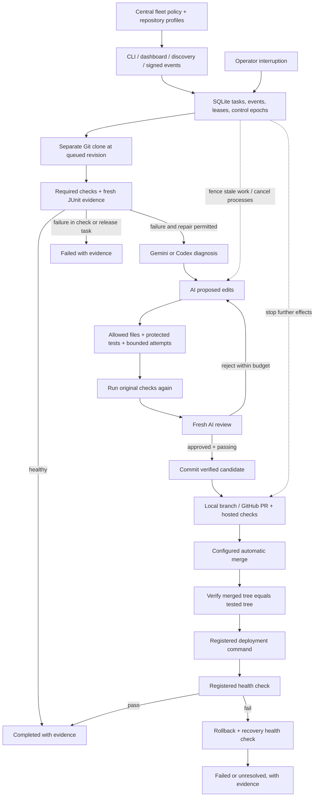

# Vultron

Autonomous repository testing, AI repair, and verified delivery.

Vultron's red-and-black agent workspace brings investigations, execution events,
task evidence, and operator controls into one interface. See the
[visual identity and compatibility notes](docs/BRAND.md).

For continuous operation, use the [supervised host launcher](docs/SERVICE_HOST.md).
The dashboard's Runtime and checks panel reports the actual worker, selected AI
provider, watching/schedule settings, and mandatory repository checks.

The [Gemini provider](docs/GEMINI.md) connects the same controlled repair workflow to Vertex AI
using host-only application credentials. Codex remains the default backend.

Vultron manages registered Git repositories through their existing test commands. It runs checks in separate clones, diagnoses failures with a real AI backend, applies narrowly permitted repairs, retests, obtains independent AI review, and publishes or merges eligible changes. Configured releases include health checks and rollback. A durable queue and localhost dashboard let an operator pause, cancel, resume, or steer work.

**Implemented:** the end-to-end single-host workflow, including authenticated Codex integration, local and GitHub delivery, scheduled discovery, release hooks, and per-run preparation/readiness/cleanup. Optional Linux Docker execution restricts source files, credentials, networking, and resources; an independent sweeper removes expired owned containers. Default local execution and release hooks remain trusted-host operations. Distributed hosting and autonomous red-team campaigns remain future work.

[CI/CD orchestration](docs/ORCHESTRATION.md) adds explicit PR, merge, nightly, and release stages,
signed GitHub event ingestion, durable supersession, and reusable hosted checks. Task intent
separates validation, repair, and release; centrally configured checks and exact revision evidence
control progression. New repositories still need explicit profiles and central registration.

## Run it

Start by inspecting your actual repository:

```text
python scripts/dev.py sync
python scripts/dev.py cli onboard https://github.com/OWNER/REPOSITORY.git C:/vultron-config/repository --owner your-team
```

The [onboarding guide](docs/ONBOARDING.md) explains the generated profile, fleet
registration, and any missing setup or test reporters. Register the project's
requirements, permitted edit paths, provider, and delivery policy once; the
worker then operates under that standing authority. Use the
[supervised host](docs/SERVICE_HOST.md), [security checks](docs/SECURITY_CHECKS.md),
and [managed deployment](docs/MANAGED_RELEASE.md) guides to provision the host.

The optional local acceptance exercise is separate:

```text
python scripts/dev.py sync
python scripts/dev.py cli demo init .katydid/demo
python scripts/dev.py cli doctor --fleet .katydid/demo/fleet.yaml
python scripts/dev.py cli demo run .katydid/demo --live-ai
python scripts/dev.py cli serve --fleet .katydid/demo/fleet.yaml --watch
```

Open **http://127.0.0.1:8765**. The demo creates three separate local Git repositories and uses the existing `codex login` session. It exercises a real AI repair/review, an already healthy repository, and a deliberately failed deployment with successful rollback. The recovery task correctly finishes `failed`; the overall demo passes only when rollback health is proven. Existing demo directories and evidence are preserved.

The pinned development environment uses Python **3.12.13** and uv **0.12.10**. The real AI adapter was exercised with Codex CLI **0.153.4**, model **gpt-5.6-sol**, and high reasoning. GitHub delivery additionally needs authenticated `gh`. CI uses explicit test doubles for model responses and does not need AI credentials.

## Execution flow



Central registration grants standing authority once. Ordinary tasks proceed without human approval queues. AI responses cannot grant themselves edit, merge, or release permissions. Missing tests, failed review, changed policy/revisions, and uncertain external outcomes cannot become successful tasks.

## Documentation

| Document | Purpose |
|---|---|
| [Runbook](docs/RUNBOOK.md) | Complete setup, commands, operation, troubleshooting, and recovery |
| [Fleet configuration](docs/FLEET.md) | Central policy, repository registration, AI budgets, delivery, and release hooks |
| [Repository onboarding](docs/ONBOARDING.md) | Committed repository discovery, structured test detection, and registration bundles |
| [Security checks](docs/SECURITY_CHECKS.md) | Pinned Semgrep, Trivy, and Gitleaks with real findings and mandatory evidence |
| [Supervised host](docs/SERVICE_HOST.md) | Worker restart, scheduling, database refresh, and owned container sweeping |
| [Managed releases](docs/MANAGED_RELEASE.md) | Immutable application versions, persistent data, rollback, and automatic recovery |
| [Operating acceptance](docs/OPERATING_ACCEPTANCE.md) | Enabled live capabilities, verified runs, and deployment boundaries |
| [Development environment](docs/DEVELOPMENT.md) | Exact environment and contributor checks |
| [Profiles](docs/PROFILE.md) / [Runs](docs/RUNS.md) | Framework-neutral command adapters, JUnit, artifacts, and cancellation |
| [AI integration](docs/AI.md) | Real provider, authentication, structured outputs, and limits |
| [Durable state](docs/STATE.md) / [Git delivery](docs/GIT.md) | Leases, interruption, crash recovery, revisions, and publication |
| [Dashboard](docs/DASHBOARD.md) | Local HTTP interface and request controls |
| [Playwright example](docs/BROWSER.md) | Browser testing through the same evidence contract |
| [Run environments](docs/ENVIRONMENTS.md) | Ordered preparation, bounded readiness, cleanup, and a real SQLite example |
| [Container isolation](docs/ISOLATION.md) | Offline Docker execution, central isolation policy, and independent expiry sweeping |
| [Live acceptance](docs/LIVE_ACCEPTANCE.md) | Recorded model, GitHub, deployment, and rollback evidence |
| [Implementation record](docs/IMPLEMENTATION.md) | Microcommit slices and validation |
| [Full platform blueprint](AUTOMATED_TESTING_PLATFORM_BLUEPRINT.md) | Detailed tool arsenal and broader architecture; proposed features are not implementation claims |

## Validate the platform

```text
python scripts/dev.py cli run katydid.yaml
python scripts/dev.py cli run examples/python-service/quality.yaml
python scripts/dev.py cli run examples/sqlite-service/quality.yaml
python scripts/dev.py build
```

GitHub Actions runs the deterministic suite on Windows and Linux. The platform cannot prove exhaustive coverage for arbitrary repositories: teams register meaningful checks, requirements, and environment commands, then Vultron executes and evaluates that contract autonomously.
