# Real Gemini and GitHub acceptance — 2026-09-08

The [private Orders Lab repository](https://github.com/AmRitJain0442/katydid-orders-lab) is a
runnable SQLite-backed order application with a browser interface, inventory allocation, and
order history. It began with one disclosed pricing defect: two $25 lamps were persisted as $25.

Katydid task `03fc6bc79ffc4dee934002f918c17bf5` used real `gemini-2.5-flash` calls through Vertex
AI for diagnosis, repair, and independent review. It completed without an operator intervening
between those steps, verification, PR creation, hosted checks, and merge.

| Evidence | Result |
|---|---|
| Original GitHub revision | `2d3afa385a5c094c2921d34c42d0c5e1b2d035c1` |
| Baseline | 15 passing Python tests, one pricing failure |
| Model calls | Three successful structured calls; 28,074 total provider-reported tokens |
| Repair | One line in `orderlab/domain.py`: multiply unit price by quantity |
| Protected tests | Unchanged |
| Local candidate verification | All 16 Python tests passed |
| Candidate | `59cbcdd8cbae7db7d24efc2f5770525534e79380` |
| GitHub PR | [PR #1](https://github.com/AmRitJain0442/katydid-orders-lab/pull/1), automatically merged |
| Required hosted jobs | Windows core, Linux core, and Chromium browser all passed |
| Merged revision | `9b745d01affb7c6d9f7e5bcea2169bc298dea93f` |
| Merged tree | Matches the verified candidate tree |
| Local application smoke | Browser-created two-lamp order persisted and displayed as $50 |

The original [seed CI run](https://github.com/AmRitJain0442/katydid-orders-lab/actions/runs/34218301019)
failed as expected. The [candidate CI run](https://github.com/AmRitJain0442/katydid-orders-lab/actions/runs/34218405690)
passed all required jobs. [Curated evidence](evidence/gemini-github-acceptance.json) records task
identity, revisions, test counts, model usage receipts, review, and the exact GitHub check results.

```mermaid
flowchart LR
    Repo[GitHub source commit] --> Tests[Protected unit and API tests]
    Tests -->|pricing failure| Diagnose[Gemini diagnosis]
    Diagnose --> Repair[Gemini repair proposal]
    Repair --> Policy[Only domain.py editable]
    Policy --> Verify[16 passing tests]
    Verify --> Review[Fresh Gemini review]
    Review --> PR[GitHub PR]
    PR --> CI[Windows + Linux + Chromium]
    CI -->|all required jobs succeed| Merge[Verified GitHub merge]
    Merge --> Local[Local app and persisted order smoke]
```



The application was served locally after the merge. This run does not claim a cloud deployment
or use the controller's release hooks. The service-account key stays on the trusted controller
host; GitHub CI receives no Gemini credentials. Raw task data, the operator fleet, local database,
and screenshots remain in ignored `.katydid/orders-lab` storage.

## Repeat a check

From the platform checkout, the configured local fleet can submit another task:

```powershell
python scripts/dev.py cli task --fleet .katydid/orders-lab/fleet.yaml submit orders --stage nightly --mode repair
python scripts/dev.py cli worker --fleet .katydid/orders-lab/fleet.yaml --once
```

Set `GOOGLE_APPLICATION_CREDENTIALS` before a worker that may need Gemini. The repaired revision
should complete healthy without model calls. A fresh repair requires a failing protected check
at the newly submitted source revision. The acceptance seed remains available in Git history;
do not reset the working main branch merely to replay the demonstration.

For a standalone app run, follow its README. The local acceptance source is
`.katydid/orders-lab/source`, and the inspection server uses `http://127.0.0.1:8790` with its
database in `.katydid/orders-lab/runtime/orders.db` while the server process remains running.
