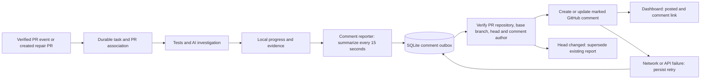

# Automatic GitHub PR comments

Vultron can maintain one progress comment per investigation on its associated
GitHub PR. It names executing tools (including Playwright), summarizes check
states, includes available AI diagnosis/review and final outcome, and links to
the PR's GitHub checks. A new investigation gets its own comment; updates to the
same investigation edit that comment.

## Enable on a registered repository

Add this field to the repository's entry in the **host-owned fleet file**:

```yaml
repositories:
  - id: orders
    source: https://github.com/your-org/orders.git
    github_comments: true
    # Keep the existing profile, required checks, requirements and other policy.
```

This is a configuration fragment, not a complete fleet file. The field defaults
to false, requires a literal boolean, and only supports registered HTTPS GitHub
sources. Validate with `python scripts/dev.py cli fleet path/to/fleet.yaml`, then
restart the worker/service at an idle boundary. Configuration changes bind new
tasks to a new policy digest; historical tasks from an older policy are not
automatically published retroactively.

The service account needs `gh` on PATH, authenticated for github.com. The reporter
uses the existing CLI authentication; it does not use Gemini credentials.
It verifies the account with `GET /user`, so use a user-authenticated CLI session
or a user access token. GitHub App installation-only tokens are not supported by
this implementation. Comments appear under that authenticated account; the
Vultron heading does not change the GitHub author's identity.

For a fine-grained user token, grant repository access and **Pull requests: write**
(including PR reads). GitHub's comment endpoints accept Issues or Pull requests
write permissions; Vultron also reads PR metadata before publishing.
See [GitHub's comment API](https://docs.github.com/en/rest/issues/comments).
Keep tokens in the service's authentication environment, never repository YAML.

## Which investigations have a PR?

- Signed PR events accepted by the existing [GitHub ingress](ORCHESTRATION.md)
  carry a verified repository, PR number, and head revision.
- When Vultron creates a repair PR, the controller persists the confirmed PR
  association before waiting for CI or merging, so reporting can start then.
- Main-branch polling, nightly runs, and manually submitted main investigations
  have no PR until they create a repair PR. They do not comment on an arbitrary
  recent PR. A `pull-request` stage label alone is not a PR association.

Enabling comments does not install a webhook or start listening for newly opened
PRs. Repositories need the separately configured ingress to investigate incoming
PRs automatically. The current Orders host has main polling; its GitHub webhook
connection still needs setup.

## Execution and recovery



The reporter runs on its own thread. The outbox is `github-comments.db` in the
configured control state directory. It coalesces changed snapshots, claims one
due update per tick, and retries failures with backoff from 15 seconds to five
minutes. These are polling intervals, not a publication SLA; network latency and
queue size add delay. Short-lived tools may finish between snapshots. Unchanged
bodies do not cause network updates. `worker --once` attempts one update after
work; continued retries require later invocations or a continuously running service.

A hidden investigation marker and the authenticated author's numeric ID identify
the owned comment. Pagination is bounded to 1,000 comments; ambiguous owned
duplicates or an exhausted discovery budget cause a retry/error instead of a
new comment. A lost POST response is recovered by rediscovering the comment on
the next attempt. A SQLite claim prevents concurrent writers sharing the same
state database. Separate hosts with independent state databases must not report
the same investigation.

Before an update, the reporter rechecks PR identity and head revision. If the
head changed, it marks an existing owned comment superseded, or creates nothing
if there was no comment. It does not continually monitor unchanged completed
reports for subsequent head changes. Every report names its revision; GitHub
comments are informational and do not replace revision-bound checks or gates.

GitHub failures never change the test verdict or block test cancellation/cleanup.
Raw stdout/stderr, local artifact paths, and full AI exchanges stay on the host.
Published prose is bounded and escaped; common credential and host-path patterns
are redacted. This filtering is not a general secret classifier. Full tool output
remains expandable in the dashboard's Live workflow view.

## Dashboard and validation

The task inspector's **GitHub report** panel shows disabled, no PR association,
queued, posted, retrying, or superseded status and a confirmed comment link when
available. `GET /api/tasks/{id}/report` exposes the same state through the existing
loopback/same-origin dashboard boundary. Disable `github_comments` in central
policy and restart to stop future reporting; existing comments are retained.

`tests/test_reporting.py` exercises creation, in-place edits, restart recovery
after a lost response, author isolation, revision changes, policy revocation,
summary filtering, literal JSON transport, and cancellation during a slow API.
Fleet/API tests validate opt-in and origin boundaries. Playwright checks retry
visibility, safe links, and transition to posted/no-association states. These use
controlled API responses; a real GitHub publication remains a separate live
acceptance check requiring connectivity and an associated PR.
