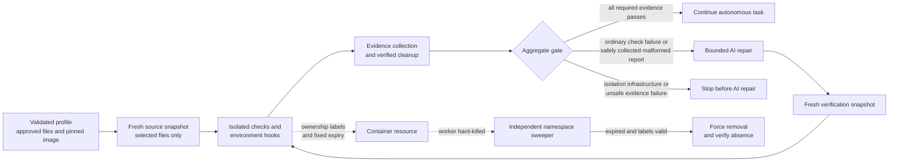

# Docker isolation

Katydid can run a repository profile in a fresh local Linux container for each command. This adapter is opt-in: profiles without `isolation` retain the trusted-host subprocess behavior, while a profile that requests Docker fails closed if Docker, its pinned image, setup, evidence collection, or removal is unavailable. It never falls back to host execution.

Docker isolation is a stronger process and filesystem boundary than a local clone, but every container shares the Docker host's kernel. It is not a virtual machine boundary for hostile code. Use a dedicated, maintained Docker host for higher-risk workloads and keep the host and daemon outside repository control. This increment supports ordinary autonomous testing and repair, not red-team campaigns.



## Profile contract

```yaml
schema_version: 1
repository: demo
owner: platform

isolation:
  adapter: docker
  image: registry.example/katydid/python@sha256:aaaaaaaaaaaaaaaaaaaaaaaaaaaaaaaaaaaaaaaaaaaaaaaaaaaaaaaaaaaaaaaa
  files:
    - app.py
    - tests/test_app.py
  namespace: katydid
  cpus: 1.0
  memory_mb: 512
  pids_limit: 128
  tmpfs_mb: 64

checks:
  - id: unit
    kind: test
    argv: [python, -m, pytest, --junitxml={report}]
    timeout_seconds: 300
```

| Field | Default and validation |
|---|---|
| `adapter` | Required literal `docker`. |
| `image` | Required repository reference ending in `@sha256:` followed by exactly 64 hexadecimal characters. A tag may precede the digest, but a tag-only or implicit-latest reference is rejected. |
| `files` | Required list of 1–500 unique, exact relative source files. Globs and directory mounts are not accepted. |
| `namespace` | `katydid`; lowercase identifier beginning with a letter, containing only lowercase letters, digits, and hyphens, at most 64 characters. It scopes ownership labels and sweeping. |
| `cpus` | `1.0`; 0.1 through 8.0. |
| `memory_mb` | `512`; 64 through 8,192 MiB. |
| `pids_limit` | `128`; 16 through 1,024 processes. |
| `tmpfs_mb` | `64`; 16 through 1,024 MiB for bounded temporary storage. |

The schema is strict. There are no profile fields for additional Docker arguments, environment variables, credentials, arbitrary mounts, privileged mode, socket access, or network selection. `validate` and `plan` only parse, resolve, and serialize this contract; they never contact Docker, inspect an image, or execute repository code.

Every listed source path must exist at plan time as a regular file within the selected repository root. Empty segments, `.`, `..`, absolute paths, Windows drives and backslashes, alternate data stream colons, control characters, Windows device names, trailing dots or spaces, symlinks, reparse points, directories, missing paths, and escapes through links are rejected. The denylist covers `.git`, `.env...`, `.ssh`, `.aws`, `.azure`, `.docker`, `.codex`, `.netrc`, `.npmrc`, and files ending in `.pem`, `.key`, `.p12`, or `.pfx`. Check and environment-lifecycle working directories must be inside directories represented by the selected snapshot. The aggregate snapshot read is capped at 64 MiB.

The file list is exact inclusion, not automatic secret detection. Katydid blocks common credential and Git metadata names, but it cannot infer secrets stored in an ordinary file such as `settings.json`. The operator must review every selected path and keep credentials out of repository snapshots.

## Runtime boundary

Before a command, Katydid copies only the declared regular files into a fresh, separate snapshot. The snapshot may live under the repository's `.katydid` state directory, but the container sees only the approved copy and sees it read-only. It runs as an unprivileged user with all Linux capabilities dropped, `no-new-privileges`, a read-only root filesystem, no external network, and the configured CPU, memory, process, and tmpfs limits. The Docker daemon must already have the exact digest-pinned image; Katydid does not pull or build images while executing a task.

Preflight resolves the effective Docker endpoint and accepts only a local Unix socket or Windows named pipe. Katydid pins that endpoint explicitly for every subsequent image, container, inspection, and removal command, so a concurrent active-context change cannot move a run to another daemon.

Each check, preparation hook, readiness attempt, and cleanup hook receives its own container. Writable host bind access is limited to that check's fresh report destination and the run-owned environment data where applicable; temporary container storage is bounded separately. Runner checkpoints, previous command output, the source snapshot, Docker socket, host credentials, and unrelated host paths remain outside writable mounts. Applications and their network test clients must run together inside one command because this increment does not create shared multi-container networks.

Containers receive Katydid ownership labels containing the namespace, immutable run/resource identity, and expiry. The expiry is the check timeout plus 60 seconds. Normal completion, check timeout, cancellation, startup failure after creation, and evidence collection all proceed through bounded removal and verification. A removal or inspection failure remains visible in lifecycle evidence and blocks the aggregate gate and any application AI repair.

Container stdout and stderr use streaming capture that writes at most 10 MiB across both host evidence files. Docker's daemon-side log driver is disabled to avoid retaining another copy. Reaching the capture cap stops the command and fails the check. This byte cap applies to Docker command logs; the trusted-host adapter still uses a polled soft threshold, and this increment does not impose an operating-system disk quota on reports, snapshots, or environment data. A `kind: test` command must write genuine JUnit to `{report}`. A missing or safely collected malformed report fails the gate and remains eligible for bounded AI repair. Unsafe or failed report collection blocks application repair because the isolated evidence cannot be trusted. A valid JUnit report containing test failures also remains eligible for repair. Environment preparation, readiness, and cleanup retain their existing ordering and fail-closed behavior under the same adapter. See [environment lifecycle](ENVIRONMENT_PLAN.md) and [run evidence](RUNS.md).

Delivery and release hooks retain their existing trusted-host execution model. Requiring container checks for a repository does not move deployment, health, or rollback commands into Docker. Keep those centrally registered commands and their host credentials under operator control.

## Central fleet enforcement

A trusted local profile can opt into Docker without a central isolation policy. That is a repository request, not proof that firm-mandated isolation was enforced. For centrally governed autonomous work, add `isolation_policy` to the repository entry:

```yaml
repositories:
  - id: demo
    source: ../demo
    context_paths: [app.py, tests/test_app.py]
    editable_paths: [app.py]
    requirements: Preserve the public API.
    required_checks: {unit: test}
    isolation_policy:
      required: true
      images:
        - registry.example/katydid/python@sha256:aaaaaaaaaaaaaaaaaaaaaaaaaaaaaaaaaaaaaaaaaaaaaaaaaaaaaaaaaaaaaaaa
      files: [app.py, tests/test_app.py]
      namespace: katydid
      max_cpus: 1.0
      max_memory_mb: 512
      max_pids: 128
      max_tmpfs_mb: 64
```

| Field | Default and policy meaning |
|---|---|
| `required` | `true`. Reject a profile without Docker isolation. Set false only when central policy deliberately permits trusted-host execution. |
| `images` | Required nonempty allowlist of digest-pinned images. The profile image must be present exactly. |
| `files` | Required nonempty unique list of source paths the profile may include. The profile may select a subset and cannot add another path. |
| `namespace` | `katydid`. Must exactly match the profile namespace. |
| `max_cpus` | `1.0`. Profile CPU limit must not exceed it. |
| `max_memory_mb` | `512`. Profile memory must not exceed it. |
| `max_pids` | `128`. Profile process limit must not exceed it. |
| `max_tmpfs_mb` | `64`. Profile tmpfs must not exceed it. |

The fleet loader rejects unknown isolation policy fields and unsafe image/path/resource values. Enforcement occurs again against the immutable plan before work begins. Repository changes cannot remove required isolation, choose an unapproved image or file, change the namespace, or raise a resource ceiling.

## Independent cleanup

Normal runner cleanup cannot execute after a hard-killed process or host. Run the namespace-scoped sweeper independently from task workers:

```text
python scripts/dev.py cli sweep --namespace katydid
python scripts/dev.py cli sweep --namespace katydid --watch --interval 30
```

One-shot mode inspects Docker once. Watch mode repeats until interrupted; `--interval` defaults to 30 seconds. Each pass rejects a nonlocal Docker endpoint and pins the accepted local endpoint for all operations in that pass. The sweeper removes only expired containers whose complete Katydid ownership labels are valid and whose namespace exactly matches the requested lowercase name. Repeated runs are safe. It leaves unlabelled, malformed, unexpired, and other-namespace containers untouched. It does not prune images, volumes, networks, or host directories.

Sweeping requires a live independent process and an available Docker daemon. If Docker is down, cleanup remains pending until a later sweep. Retained task evidence identifies the owned resource and the failed removal; the system must not infer cleanup from elapsed time.

## Operator preparation and remaining limits

Install Docker on the private execution host and preinstall every approved digest before starting workers. Confirm the daemon is reachable and use the fleet policy to keep image and file authority centralized. Do not inject Docker registry, cloud, source-control, or application credentials into a profile; offline execution has no credential-broker path.

The current adapter is local, Linux-container, offline, and single-container-per-command. It does not provide multi-container orchestration, cloud/device environments, network services shared between commands, credential injection, VM-grade hostile-code isolation, host evidence disk quotas, or automatic security campaigns. The broader direction is recorded in the [automated testing platform blueprint](../AUTOMATED_TESTING_PLATFORM_BLUEPRINT.md); this document describes the implemented isolation increment only.
