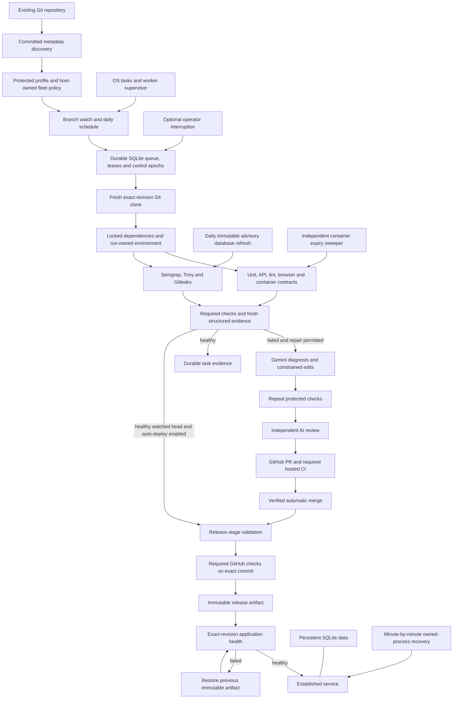

# Vultron operating acceptance — 8 September 2026

This records the capabilities enabled on the current Windows host and the real
GitHub Orders application. It supplements the broader blueprint; it does not
claim that every proposed framework or deployment backend is implemented.

## Enabled pipeline

The application profile requires all eight checks at pull-request, merge,
nightly, and release stages. Central fleet policy independently requires the same
check identifiers and kinds, so removing a required check cannot make a run pass.

| Check | Actual execution | Latest unattended evidence |
|---|---|---|
| isolated-contracts | Pinned Python Linux container, nonroot, offline, read-only source, bounded resources | Four passing application/containment contracts |
| unit | Locked Python environment and pytest | 17 passed; one optional deep-path Docker regression skipped here |
| api | Real loopback HTTP and temporary SQLite through pytest | Eight passed |
| lint | Ruff | Passed |
| browser | Playwright Chromium against a real temporary application server | One complete order flow passed |
| static-analysis | Semgrep 1.176.1 with committed local rules | Clean real scan |
| dependency-vulnerabilities | Trivy 0.74.0 with verified current advisory database | Clean real scan of recognized committed manifests |
| secret-detection | Gitleaks 8.30.1 with committed configuration | Clean real scan |

Preparation creates a run-owned Python environment from the lockfile, installs
locked Node dependencies, and provisions Chromium. Cleanup verifies ownership
before removing that run's Python environment. Reports, logs, and run metadata
remain available in durable task storage.

Security scanners receive a private snapshot of tracked current file contents,
plus any explicitly approved extra files. Unexpected nonignored untracked files,
missing tools, malformed results, or stale vulnerability data block the gate.
Ignored credential files and dependency directories are excluded. These scans
cover their selected rules, supported ecosystems, and advisory snapshot. The
initial Semgrep ruleset contains three Python rules and needs expansion for each
team's languages and threat model.

## Continuous operation

| Component | Enabled behavior |
|---|---|
| Vultron-Worker scheduled task | Starts at user logon; Python supervisor restarts an exited worker with bounded backoff |
| Branch discovery | Checks registered main branch every 60 seconds; head/policy identity prevents duplicate work |
| Periodic discovery | Rechecks unchanged heads daily |
| Gemini | Vertex AI gemini-2.5-flash, six-call task budget, separate diagnosis/repair/review requests, host-owned credentials |
| GitHub delivery | Verified PR publication and configured automatic merge after required hosted checks |
| Automatic deployment | Watched healthy commits run the release-stage profile and wait for required GitHub checks on the exact SHA before deployment; failing editable commits retain the bounded AI repair path |
| Container sweeper | Runs independently every 30 seconds for the owned vultron-orders namespace |
| Vultron-Worker-SecurityDB | Refreshes vulnerability data daily; atomic generation publication, bounded operational logs |
| Vultron-Orders-Recovery | Checks the established application every minute and at logon; recovers verified crashed processes |
| Dashboard | Local task controls, durable events/evidence, selected provider and actual required-check inventory |

Central registration grants standing authority once. Tasks run without approval
prompts within that authority. The operator can pause, cancel, resume, or steer
tasks; AI cannot grant itself permission to edit tests, execution profiles,
credentials, or additional application files.

The live Orders edit allowlist covers `orderlab/domain.py`, `orderlab/database.py`,
`orderlab/app.py`, and the three `static/` application files. Tests, browser checks,
execution scripts, profiles, and security rules remain outside edit authority.

## Flow

## Evidence

- Application commit `3816666a4f9b1d0b5388d1bf4a578e5a6919409d` passed
  [GitHub CI run 34234082446](https://github.com/AmRitJain0442/katydid-orders-lab/actions/runs/34234082446).
- Unattended merge task `c6e57ba6033746e2a89f91262a34298a` and nightly task
  `5b2fb20117074e63b6babff6725bc391` completed with all eight checks and environment
  cleanup passing. Healthy tasks used zero model calls.
- The earlier genuine Gemini repair task
  `03fc6bc79ffc4dee934002f918c17bf5` remains in the same durable task history.
  It repaired application logic and completed GitHub delivery. The eight-check
  pipeline was enabled afterward; these are distinct acceptance records.
- Security adapters passed genuine clean/finding/error tests on Windows and Linux
  in [platform CI run 34233769055](https://github.com/AmRitJain0442/katydid/actions/runs/34233769055).
- A real Docker regression passed with a 319-character outer report path.
  Nested execution uses a short temporary mount root; retained JUnit bytes match
  the original, and both Docker and temporary-directory cleanup were confirmed.
- The live application moved from commit `6c472ac` to `3816666`, rolled back to
  `6c472ac`, passed revision-specific health, and returned to `3816666`. Its
  pre-existing order and SQLite data survived every cutover.
- After the verified owned application process was deliberately terminated,
  the scheduled recovery task restored the same artifact and data. Its recorded
  task result was zero and its recovery log reported `recovered: true`.
- Watched task `630cfe77347c4a09a983e2607b0ce3fe` subsequently completed an
  automatic release of `50cee56e249f7e88caef54ea7e99fc8d31059b00`. All eight merge
  checks, all eight release checks, deployment, and exact-revision health passed.
  It used zero model calls and updated the durable last-success pointer.
- Platform run `75f5153006c348febbfbdac07c6d2c6c` passed lint, formatting, types,
  and the complete local suite: 492 passed, 11 platform-specific or opt-in skips.
  Dashboard Playwright run `c76e6086308246f4a48656fb42e3c158` also passed.
- Remote onboarding inspected the private GitHub application's exact `50cee56`
  revision, preserved its eight-check profile, and generated a validation-only
  registration using the `orders` fleet alias without changing source files.
- The exact-commit GitHub gate independently verified `Core (ubuntu-24.04)`,
  `Core (windows-2022)`, `Browser`, and `Vultron pipeline` on `50cee56` before
  permitting release hooks. Missing, pending, failed, ambiguous, or wrong-revision
  evidence cannot be accepted as a passing required check.

The two failed Docker tasks preceding the Windows path fix remain visible.
They are historical failures, not erased or reclassified as successful runs.

## Current boundaries

- The deployed host and application are local. Windows tasks require the configured
  user to be logged on; an always-on server/service account is a deployment choice
  still to be provisioned.
- GitHub branch polling is live. Signed webhook ingestion is implemented, but no
  public HTTPS ingress has been configured for this host.
- Container contracts are isolated. Dependency preparation, other application
  checks, AI execution, and release hooks currently use the trusted host. This is
  not a sandbox for arbitrary hostile repositories.
- Onboarding detects supported existing test conventions and preserves authored
  profiles. Unsupported test reporters, application environments, ownership, and
  release destinations still need repository-specific configuration.
- Browser, API, dependency, secret, and static checks are enabled here. Load,
  mutation, broad fuzzing, mobile, and dynamic security campaigns are not implied
  by those checks. Autonomous red-team campaigns remain the deferred second phase.
- The deployment adapter supports one loopback process with a fixed-port cutover.
  Distributed workers, fleet-wide high availability, cloud rollout controllers,
  and zero-downtime deployment are outside this implementation.

See [onboarding](ONBOARDING.md), [security](SECURITY_CHECKS.md),
[host operation](SERVICE_HOST.md), and [managed releases](MANAGED_RELEASE.md) for
reproducible setup and operation.
