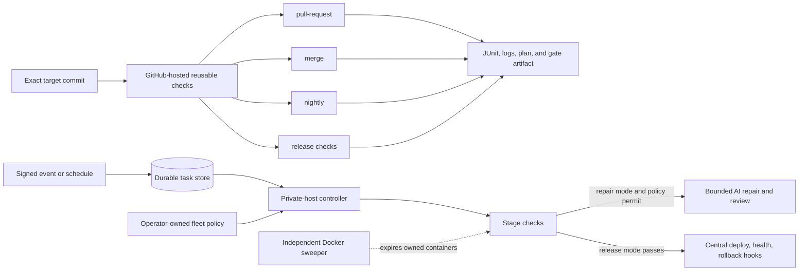

# Stage orchestration

Katydid uses the same four stage names in repository profiles, hosted GitHub checks, durable
tasks, scheduled discovery, and signed GitHub events:

| Stage | Intended trigger | Typical scope |
|---|---|---|
| `pull-request` | proposed change | fast unit, lint, and contract checks |
| `merge` | new base-branch head | integration checks against the merged tree |
| `nightly` | periodic recheck | extended regression and compatibility checks |
| `release` | release candidate | pre-release smoke and acceptance checks |

These names select checks; they do not imply a test suite. Every check lists its stages, and
every stage that an operator runs must select at least one required check. The two small
profiles in [`examples/staged-service`](../examples/staged-service) and
[`examples/staged-library`](../examples/staged-library) show independent, dependency-free
adoption recipes with a distinct required check for each stage.



## Reusable hosted checks

[`reusable-checks.yml`](../.github/workflows/reusable-checks.yml) is a `workflow_call`
workflow. It accepts only these inputs:

| Input | Contract |
|---|---|
| `stage` | Exactly `pull-request`, `merge`, `nightly`, or `release`. |
| `profile` | A bounded portable relative `.yaml` or `.yml` path in the target repository. Traversal, symlink components, `.git`, and `.env...` components are rejected. A pull request must contain the same profile bytes as its exact base commit. |
| `target_ref` | Exact lowercase 40-character triggering revision: the pull-request head SHA for a PR, otherwise `github.sha`. |
| `platform_ref` | Exact lowercase 40-character commit SHA in `AmRitJain0442/katydid`. |
| `artifact_suffix` | Lowercase identifier used to keep matrix artifacts distinct. |

The job runs on Ubuntu 24.04 with a ten-minute job timeout and `contents: read`. It validates
inputs before checkout, checks out the target at `target_ref` under `target/`, and checks out
Katydid at `platform_ref` under `platform/`. A pull request target is fetched from its head
repository, including a fork; other targets come from the caller repository. Pull-request jobs
also check out the exact base SHA under `policy/`, reject links in both profile paths, and require
the target profile bytes to equal the base profile bytes. All checkout identities are verified
with Git. Checkout credential persistence is disabled. The job then installs uv 0.12.10, syncs the
platform lock file, verifies Python 3.12.13, and executes:

```text
uv run --project platform --locked katydid run target/PROFILE --stage STAGE --root target --output target/.katydid/ci/STAGE
```

The evidence directory is uploaded even when the check fails. The artifact name contains the
caller-provided suffix, stage, workflow run ID, and run attempt; retention is seven days. The
workflow does not accept an output path, repository name, action ref, arbitrary command, or
extra runner permissions from the caller.

GitHub associates the `github` context in a called workflow with the caller. In particular,
`github.workflow_sha` does not give this workflow a normal expression for the called workflow's
commit. GitHub exposes `job_workflow_sha` as an OIDC claim, but this check workflow deliberately
does not request `id-token: write`. Therefore the workflow validates that both inputs are
immutable SHAs but cannot prove they are equal. The operator must use the same reviewed Katydid
commit in the caller's `uses` reference and `platform_ref`. This follows GitHub's recommendation
to use a full commit SHA as the immutable way to reference an action or reusable workflow.

For another repository, add a thin caller like this. It pins the same implementation revision
in both positions; upgrade both references together after validating a new platform revision:

```yaml
name: Katydid pull-request checks

on:
  pull_request:

permissions:
  contents: read

jobs:
  katydid:
    uses: AmRitJain0442/katydid/.github/workflows/reusable-checks.yml@75a6b695a76008a734766209f689af135434f5cc
    with:
      stage: pull-request
      profile: quality.yaml
      target_ref: ${{ github.event.pull_request.head.sha }}
      platform_ref: 75a6b695a76008a734766209f689af135434f5cc
      artifact_suffix: service
    permissions:
      contents: read
```

Platform references must remain literal lowercase 40-character SHAs, not tags or branches.
The reusable workflow binds `target_ref` to the triggering revision. A pull-request
caller must use `${{ github.event.pull_request.head.sha }}`; every other trigger must use
`${{ github.sha }}`. This prevents a current check run from testing an older healthy commit. The
workflow fetches a PR head from `${{ github.event.pull_request.head.repo.full_name }}` so the
same rule works for a fork.

Use the corresponding pair for other thin callers:

| GitHub trigger | `stage` | `target_ref` |
|---|---|---|
| `pull_request` | `pull-request` | `${{ github.event.pull_request.head.sha }}` |
| push to the base branch | `merge` | `${{ github.sha }}` |
| `schedule` | `nightly` | `${{ github.sha }}` |
| published `release` | `release` | `${{ github.sha }}` |

Put only the triggers the repository intends to support in its caller. A scheduled workflow uses
the current default-branch revision. A GitHub release workflow uses the revision associated with
the release event; the hosted release stage still runs checks only.

The platform repository's own
[`stage-acceptance.yml`](../.github/workflows/stage-acceptance.yml) calls the local reusable
workflow for all four stages and both example repositories. The eight Ubuntu jobs have stable,
unique names and artifact suffixes. On push or dispatch, `${{ github.sha }}` is both the target
and platform revision. On a pull request, the target is the exact head SHA and the platform is
the event's merge revision used to test the proposed Katydid change.

GitHub documents that reusable workflows are called at the job level, that their `github`
context is associated with the caller, and that the default checkout repository is the caller.
Katydid supplies explicit repositories and paths instead of relying on that checkout default.
See GitHub's [reuse workflow reference](https://docs.github.com/en/actions/how-tos/reuse-automations/reuse-workflows),
[context reference](https://docs.github.com/en/actions/reference/workflows-and-actions/contexts),
and [secure use reference](https://docs.github.com/en/actions/reference/security/secure-use).

## What the hosted job gates

The hosted job runs the checks selected by the base-approved target profile. A `kind: test` check
must produce valid JUnit evidence, and the aggregate gate fails when any required check fails.
Configure the resulting GitHub check as a required branch-protection check if merging must wait
for it. The pull-request byte comparison prevents a contributor from weakening the profile in
the same change. Protect the thin caller and its check adapters with normal repository review
controls such as CODEOWNERS; a contributor who can change the caller or an adapter invoked by an
unchanged profile can still weaken a profile-controlled gate.

The reusable workflow is deterministic CI. It does not invoke the Codex provider, carry live
ChatGPT credentials, repair a change, merge a branch, deploy a release, or run the controller's
central release hooks. A `release` invocation runs only the repository profile's release-stage
checks. Keep live model authentication, GitHub delivery credentials, deployment credentials,
and environment access on the private controller host and out of hosted CI and uploaded
artifacts.

GitHub-hosted runners execute repository commands and can reach the network. Read-only workflow
permissions and nonpersistent checkout credentials reduce authority but do not turn a hosted
runner into a hostile-code sandbox. Use reviewed check definitions and the profile's Docker
isolation when the repository's trust model requires it.

## Run the stage fixtures locally

From the Katydid repository root:

```text
python scripts/dev.py sync
python scripts/dev.py cli run examples/staged-service/quality.yaml --root . --stage pull-request
python scripts/dev.py cli run examples/staged-service/quality.yaml --root . --stage merge
python scripts/dev.py cli run examples/staged-service/quality.yaml --root . --stage nightly
python scripts/dev.py cli run examples/staged-service/quality.yaml --root . --stage release

python scripts/dev.py cli run examples/staged-library/quality.yaml --root . --stage pull-request
python scripts/dev.py cli run examples/staged-library/quality.yaml --root . --stage merge
python scripts/dev.py cli run examples/staged-library/quality.yaml --root . --stage nightly
python scripts/dev.py cli run examples/staged-library/quality.yaml --root . --stage release
```

Each profile uses only Python's standard library and writes one genuine JUnit test case for the
selected stage. It is a structure example; replace its checks with the target repository's real
framework commands and adapters.

## Durable autonomous orchestration

Hosted checks and the controller can use the same profile, but their authority differs. A fleet
entry is operator owned and overlays central policy on the repository profile:

```yaml
repositories:
  - id: payments
    source: https://github.com/example/payments.git
    profile: quality.yaml
    context_paths: [app.py, tests/test_app.py, tools/checks.py]
    editable_paths: [app.py]
    requirements: Preserve the public API and stored data format.
    required_checks:
      common-contract: test
    required_checks_by_stage:
      pull-request: {pr-unit: test}
      merge: {merge-integration: test}
      nightly: {nightly-regression: test}
      release: {release-smoke: test}
    isolation_policy:
      required: true
      images:
        - registry.example/tests@sha256:aaaaaaaaaaaaaaaaaaaaaaaaaaaaaaaaaaaaaaaaaaaaaaaaaaaaaaaaaaaaaaaa
      files: [app.py, tests/test_app.py, tools/checks.py]
    events:
      github_repository: example/payments
      pull_requests: true
      pushes: true
      releases: false
```

`required_checks` applies to every stage the fleet executes. `required_checks_by_stage` adds
requirements only for the named stage. Enforcement rejects a missing check, an advisory check,
or a kind mismatch after the profile is resolved at the exact task revision. Keep the fleet file
in an operator-owned location outside the registered source so repository code cannot change it.
This is stronger than the hosted workflow by itself, which has no fleet input and gates only the
selected profile.

Manual submissions make stage and authority explicit:

```text
python scripts/dev.py cli task --fleet path/to/fleet.yaml submit payments --stage pull-request --mode repair
python scripts/dev.py cli task --fleet path/to/fleet.yaml submit payments --stage merge --mode check
python scripts/dev.py cli task --fleet path/to/fleet.yaml submit payments --stage nightly --mode check
python scripts/dev.py cli task --fleet path/to/fleet.yaml submit payments --stage release --mode release
```

`check` records the gate and never calls AI. `repair` is bounded repair and review authority and
is valid only from the registered base revision; pull-request event source refs are always
check-only. `release` requires the release stage and centrally registered deploy, health, and
rollback hooks. For repair-and-deliver repositories that have central release hooks, Katydid
runs the candidate's release-stage profile checks before publication, then executes the central
release hooks only for the exact delivered tree.

Base-branch discovery creates `merge` tasks. A schedule creates separate `nightly` tasks for
unchanged heads. Discovery preserves autonomous repair for registered repositories with a
nonempty central `editable_paths` list; those tasks use `repair`. A repository with no editable
paths gets `check` tasks instead:

```text
python scripts/dev.py cli worker --fleet path/to/fleet.yaml --watch --interval 60 --schedule-seconds 86400
```

The schedule bucket is part of the durable idempotency key. Any discovery repair still uses the
same edit allowlist, attempt and model-call budgets, fresh verification, independent review, and
delivery policy as a manual repair.

## Signed GitHub events

For event-driven tasks, configure `events` on the matching GitHub repository and run a separate
receiver with a webhook secret of at least 32 bytes:

```text
python scripts/dev.py cli webhook --fleet path/to/fleet.yaml --host 127.0.0.1 --port 8766 --secret-env KATYDID_WEBHOOK_SECRET
```

The default listener is loopback. Connecting GitHub to it requires operator-controlled ingress;
do not expose the dashboard in its place. The receiver accepts bounded JSON only at
`/webhooks/github`, verifies `X-Hub-Signature-256`, deduplicates delivery IDs, and reconciles the
event with current Git and GitHub state before queueing. A durable replay key also identifies the
event type and signed body: changing the unsigned delivery-ID header cannot enqueue the same
signed payload again. Aliases retain the original task and receipt history, including after restart.
Legacy delivery-ID receipts remain replayable after migration.

Event mapping:

| GitHub event | Task |
|---|---|
| open/current pull request targeting the registered base | exact PR head, `pull-request`, `check` |
| push to the registered base | exact base head, `merge`, `check` |
| published release whose tag equals the current base | exact tag, `release`, `release` |

Pull-request event ingestion requires centrally mandatory Docker isolation. The controller also
rejects changes to the centrally protected profile or context files before running a PR source
revision. Release events must be enabled explicitly and require central release hooks. Event
grouping cancels superseded work and prevents an older delivery from winning a race with current
provider state.

Retargeting a PR reconciles its current base and cancels prior work if it no longer targets the
registered branch. A superseded paused task leaves its replacement paused. If a predecessor has
an uncertain publication or deployment outcome, the replacement also remains paused with recorded
reconciliation requirements instead of immediately repeating an external operation.

Webhook PR and push tasks are deliberately check-only, even when watch discovery for the same
registered repository has repair authority. Their gate and event receipt remain in Katydid's
local task store; this increment does not publish that local result as a GitHub provider check.
The reusable hosted workflow is the path that produces a GitHub Actions check suitable for
branch protection.

## Profile migration

Older profiles commonly omit `stages`, which means `pull-request` only. Before enabling merge,
nightly, release, scheduled discovery, release hooks, or the eight-job acceptance matrix:

1. Add each intended stage to at least one required check. Watch users need `merge`, scheduled
   watch users also need `nightly`, and repositories with release hooks need `release`.
2. Ensure every fleet `required_checks` entry is present with the same kind and `required: true`
   in every stage the fleet will execute.
3. Put stage-specific mandatory checks in `required_checks_by_stage`.
4. Add explicit release-stage checks before enabling a release task or a repair flow with central
   release hooks. Release hooks are deployment adapters; they do not replace candidate checks.
5. Run `validate`, `plan`, and `run` for each used stage, then update required GitHub checks and
   the operator-owned fleet in a reviewed change.

A stage with no selected required check fails at planning. A central requirement missing from a
stage fails policy enforcement. These failures stop before AI or release side effects.

## Cleanup and operational separation

Docker containers carry namespace and expiry labels, but a killed worker cannot run its own
cleanup. Operate the namespace sweeper as an independent process from the worker, webhook, and
hosted CI jobs:

```text
python scripts/dev.py cli sweep --namespace katydid --watch --interval 30
```

The sweeper only removes expired, validly owned containers in that namespace. See
[Docker isolation](ISOLATION.md) for the exact boundary and [operator runbook](RUNBOOK.md) for
onboarding, durable controls, crash behavior, and unresolved external effects.
