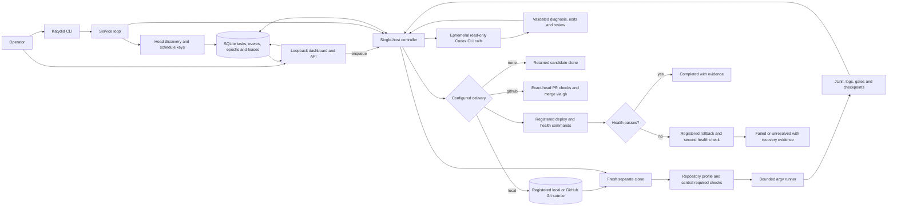

# Katydid operator runbook

Katydid is a single-host, evidence-driven test and repair service for repositories that an operator has explicitly registered. After one central onboarding decision, it can discover changes, run protected checks, obtain real model diagnosis and repair proposals, verify and independently review a candidate, deliver it under policy, and run configured release and recovery commands without routine human approval. Humans remain able to inspect, pause, cancel, steer, and resume active tasks.

It is not a red-team system, a container service, or a security boundary for hostile code. Repository checks and release hooks run as local subprocesses with the service account's permissions. Separate clones protect the source working tree and Git object storage from accidental coupling; they do not isolate untrusted programs. Register only trusted repositories and commands on a private operator-controlled host.

## Implemented system



The standalone `validate`, `plan`, and `run` commands also remain available for one repository profile without creating a durable fleet task.

## Supported host and tools

The repository pins and tests this environment:

| Tool | Supported setup |
|---|---|
| Python | 3.12.13, pinned by `.python-version` |
| uv | 0.12.10, pinned by `.uv-version`, `pyproject.toml`, and the development helper |
| Git | Required for every fleet repository and workspace |
| Codex CLI | Required for repairable failures; 0.153.4 is recorded in `.codex-version`, and the accepted live probe used it with `gpt-5.6-sol` and high reasoning |
| GitHub CLI (`gh`) | Required only for repositories using `delivery.mode: github` |
| Node.js | Optional; needed when the discovered Codex executable is an npm `.cmd`, `.bat`, or `.ps1` launcher |
| Browser | Optional for the local dashboard and the initial ChatGPT sign-in flow |

Windows and Linux are the CI targets. macOS has not been verified. Install Git, a bootstrap Python, and `uvx`, then run from this repository root:

```text
python scripts/dev.py sync
python scripts/dev.py cli --version
python scripts/dev.py lint
python scripts/dev.py format-check
python scripts/dev.py typecheck
python scripts/dev.py test
```

`scripts/dev.py` launches uv 0.12.10 through `uvx`, performs a locked sync into `.venv`, and forwards later arguments without composing a shell command. No activation or global pip installation is needed.

## One-time operator onboarding

1. Give every trusted repository a profile that invokes its real checks and writes JUnit evidence for checks declared as tests. Validate it with `python scripts/dev.py cli validate REPOSITORY/quality.yaml` and inspect the deterministic plan with `python scripts/dev.py cli plan REPOSITORY/quality.yaml`.
2. Create the central fleet file and its `state_directory` in an operator-owned location outside every registered local source repository. Task clones are created below the state directory, and Katydid rejects a clone destination inside its source. Register each exact Git source only once, along with its base branch, readable context files, the narrower editable implementation files, standing requirements, mandatory check IDs and kinds, attempt budgets, and delivery/release authority. See [fleet policy](FLEET.md).
3. For local model use, install the Codex CLI and run `codex login`, completing the ChatGPT browser flow. `codex exec` reuses that saved login, so this path does not require an API key. `codex login status` shows the active method. See the official OpenAI documentation for [authentication](https://learn.chatgpt.com/docs/auth) and [non-interactive mode](https://learn.chatgpt.com/docs/non-interactive-mode).
4. If any repository uses GitHub delivery, install `gh`, authenticate it for the named repository, and configure the desired GitHub checks and branch rules. Katydid does not configure or bypass those rules.
5. Validate the central policy and host dependencies:

```text
python scripts/dev.py cli fleet path/to/fleet.yaml
python scripts/dev.py cli doctor --fleet path/to/fleet.yaml
```

`doctor` checks Python, Git, Codex CLI availability and saved authentication. It also checks `gh auth status` when any registered repository selects GitHub delivery. It does not execute repository checks or submit a task.

Once this policy is accepted and the service is started, eligible work proceeds under it without an approval prompt between diagnosis, edit, verification, review, configured delivery, and configured release. A reviewer response alone is insufficient: original required checks must pass, protected files must remain identical, the diff must stay in the editable allowlist, the independent structured review must approve with no concerns, and the relevant source, policy, and lease identities must still match. After commit, the workspace must have no remaining tracked diff and the base-to-commit binary diff must exactly match the reviewed candidate before delivery begins.

## Reproducible live demonstration

Create the demo only in a new or empty directory:

```text
python scripts/dev.py cli demo init .katydid/demo
python scripts/dev.py cli doctor --fleet .katydid/demo/fleet.yaml
python scripts/dev.py cli demo run .katydid/demo --live-ai
```

`--live-ai` is mandatory. There is no fake fallback. The demo creates three local Git repositories and a central fleet:

- `pricing` begins with a real failing JUnit case, is diagnosed and repaired by the authenticated model, verified, independently reviewed, locally merged, deployed, and health checked.
- `catalog` begins healthy, completes from baseline evidence, and makes no model call.
- `recovery` is repaired and merged, then its fixture deployment deliberately fails health; the registered rollback restores the previous deployment and passes its second health check. The task remains `failed` because release failed, while the overall acceptance succeeds because recovery is proven.

The command writes `.katydid/demo/acceptance.json`. It reports the three durable task records, whether protected verifier hashes stayed unchanged, and the number of receipts whose provider is the real `codex` backend.

## Running the service

Start the dashboard and worker together:

```text
python scripts/dev.py cli serve --fleet path/to/fleet.yaml --watch --interval 60
```

Open the printed loopback URL, normally `http://127.0.0.1:8765`. The server rejects external bindings and has no user authentication; do not publish it through a proxy, tunnel, shared container port, or nonlocal interface. See [dashboard boundaries](DASHBOARD.md).

`--watch` checks each registered base-branch head every `--interval` seconds and enqueues a head only once for the current policy digest. To retest an unchanged head in time buckets, add a positive schedule:

```text
python scripts/dev.py cli serve --fleet path/to/fleet.yaml --watch --interval 60 --schedule-seconds 3600
```

`--schedule-seconds` has an effect only with `--watch`. The period becomes part of the idempotency key, so one task is created per repository, head, policy digest, and schedule bucket. With no watch flag, the service processes only tasks submitted through the CLI or dashboard.

For a headless worker without the dashboard, use:

```text
python scripts/dev.py cli worker --fleet path/to/fleet.yaml
python scripts/dev.py cli worker --fleet path/to/fleet.yaml --once
```

The bundled service worker processes one task at a time. If multiple local worker processes share the SQLite store, fenced leases allow work on different repositories while preventing two live tasks for the same repository. Another process can take later work after safe lease expiry. This is not distributed execution or repository-command isolation.

## Submit, inspect, and control tasks

```text
python scripts/dev.py cli task --fleet path/to/fleet.yaml submit payments --key ticket-1842
python scripts/dev.py cli task --fleet path/to/fleet.yaml list
python scripts/dev.py cli task --fleet path/to/fleet.yaml show TASK_ID
python scripts/dev.py cli task --fleet path/to/fleet.yaml events TASK_ID

python scripts/dev.py cli task --fleet path/to/fleet.yaml pause TASK_ID
python scripts/dev.py cli task --fleet path/to/fleet.yaml resume TASK_ID
python scripts/dev.py cli task --fleet path/to/fleet.yaml steer TASK_ID "Preserve compatibility with stored v2 payloads"
python scripts/dev.py cli task --fleet path/to/fleet.yaml cancel TASK_ID
```

An optional submission key is idempotent only for the same repository and canonical task payload. A conflicting reuse is rejected.

Every accepted control is committed to SQLite before the command returns. It increments the control epoch and revokes the current lease. The worker checks its lease during execution and before side effects, and a heartbeat detects controls during long checks or model calls.

| Control | Implemented effect |
|---|---|
| `pause` | Moves ordinary in-flight or queued work to `paused`. It remains there across worker restarts. |
| `resume` | Accepted only for a paused task; returns it to `queued`, where a fresh claim revalidates policy and source evidence. |
| `steer` | Appends the instruction and queues a fresh attempt from current source evidence. It does not mutate the original task payload. |
| `cancel` | Makes ordinary work terminal `cancelled`. The old worker cannot later record success. |

An interrupt cannot reverse an external Git or release operation that has already committed. Pause, cancel, or steer during `publishing`, `deploying`, or `monitoring` therefore produces terminal `unresolved` with `reconciliation_required`, rather than claiming that the operation stopped or automatically replaying it. Terminal tasks, including unresolved tasks, reject resume and further controls.

## Evidence and outcomes

The fleet's `state_directory` contains:

```text
state.db                         durable tasks and append-only events
tasks/TASK_ID/EPOCH/workspace/   separate candidate clone
tasks/TASK_ID/EPOCH/runs/        baseline and verification run directories
tasks/TASK_ID/EPOCH/ai/          prompts, schemas, CLI events, stderr, responses, receipts
tasks/TASK_ID/EPOCH/candidate.json
tasks/TASK_ID/EPOCH/outcome.json
releases/REPOSITORY/             registered release adapter state
```

Each runner directory retains its invocation, stdout/stderr, original profile, plan, parsed results, and aggregate gate. Test checks fail closed when JUnit evidence is missing or cannot prove at least one executed passing test. Inspect task `result`, events, `outcome.json`, and the individual run files before deciding what happened; a label without its evidence is not proof.

Normal terminal meanings are:

- `completed` with `outcome: healthy`: the original baseline passed and no AI or delivery was needed.
- `completed` with `outcome: repaired`: baseline failed, a candidate passed verification and independent review, and all configured delivery/release steps completed.
- `failed`: a known error blocked completion, including a release failure whose rollback was verified healthy.
- `cancelled`: control stopped work before a potentially committed external stage.
- `unresolved`: the controller cannot safely assert the outcome of publication, deployment, monitoring, or recovery.

## Restart, crash, and unknown outcomes

Tasks and events survive service restarts in SQLite. A worker claim normally lasts 60 seconds and is renewed every five seconds by the controller heartbeat. At the start of each work attempt, expired leases are fenced:

- expiry during preparation, testing, diagnosis, repair, verification, or review queues the task for a fresh attempt;
- expiry during `publishing`, `deploying`, or `monitoring` moves it to terminal `unresolved`, records the previous state, and sets `reconciliation_required: true`.

On a graceful `SIGINT` or `SIGTERM`, the bundled service stops discovery and new claims. If its active task is still before the potentially external publication/deployment stages, the controller releases the lease and returns the task to `queued` immediately. Shutdown during `publishing`, `deploying`, or `monitoring` remains `unresolved`, because stopping the local process cannot prove whether the external effect committed.

The current implementation deliberately does not automate provider-specific reconciliation of an unresolved task. An operator must inspect the recorded candidate SHA, local/GitHub branch or PR, release directory, target health, and event trail to determine what committed. Do not resume or blindly resubmit the same external action. After external state is made known and safe, submit a new task with a new idempotency key; the new task captures the current source head and reruns the full gates. Preserve the unresolved record as the audit trail.

Release behavior is similarly evidence-based. Deploy is followed by health. On failure, rollback and health run automatically. A proven healthy rollback is a known failed task. If release and recovery cannot prove health, the task is unresolved and requires target inspection.

## Policy and source changes

The controller hashes the fleet file when it starts and records that digest plus the exact base-branch SHA in every new task. It refuses new work if the on-disk fleet changes. Restart the service after any fleet edit. Tasks created under the old digest cannot execute under the new controller; submit fresh tasks so new standing requirements, paths, budgets, and authority are explicit.

A source head change after submission also rejects the stale task. Submit a new task for the new head. Katydid does not silently transplant a reviewed repair across a different base, preserve an old gate across a policy change, or update a queued task in place. Changing repository source, profile, required checks, editable paths, delivery, or release authority always needs a new fleet digest, service restart, and fresh task.

## Deterministic CI and live credentials

Committed CI runs on Ubuntu 24.04 and Windows Server 2022 with read-only repository permission, locked dependencies, and pinned action revisions. It runs Katydid's own profile, the separate example profile, the complete deterministic test suite, and a package build; evidence is uploaded for seven days. Model boundary and controller tests inject explicitly configured local fake providers. They exercise valid, invalid, timeout, cancellation, review, repair, delivery, and recovery paths without claiming a live model result.

CI does not receive Codex, ChatGPT, GitHub delivery, or deployment credentials and does not run `demo run --live-ai`. Keep `~/.codex/auth.json` and tokens off repository-controlled runners and out of artifacts. Official OpenAI guidance treats the auth cache like a password and recommends scoped automation credentials or workload identity for trusted automation rather than broad job-level secrets.

Run the live demo or another real-model acceptance separately on the private authenticated host. Keep its receipts and original evidence with the task, and report it separately from deterministic CI. A fake-provider pass cannot substitute for live-model evidence, and a live model response cannot substitute for deterministic gates.

The [automated testing platform blueprint](../AUTOMATED_TESTING_PLATFORM_BLUEPRINT.md) describes a broader future architecture. This runbook covers the implemented single-host autonomous repair path and does not claim remote sandboxes, multi-tenant isolation, credential brokering, cross-host workers, notification integrations, or automatic reconciliation of unknown external outcomes.
